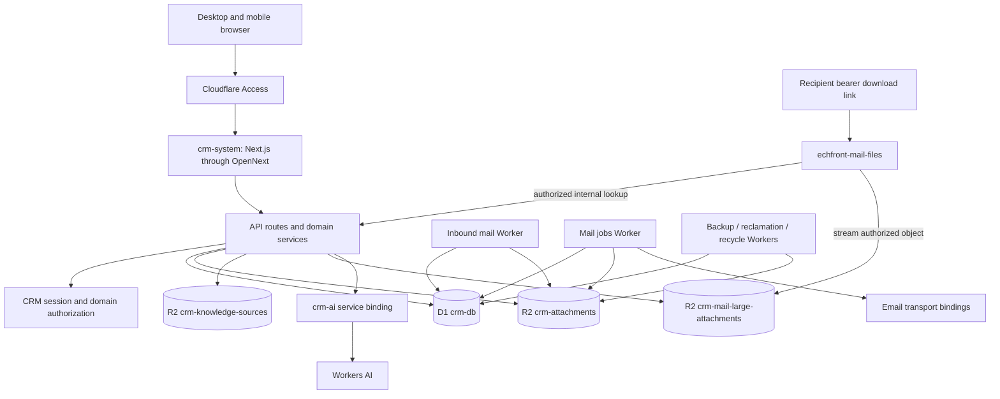
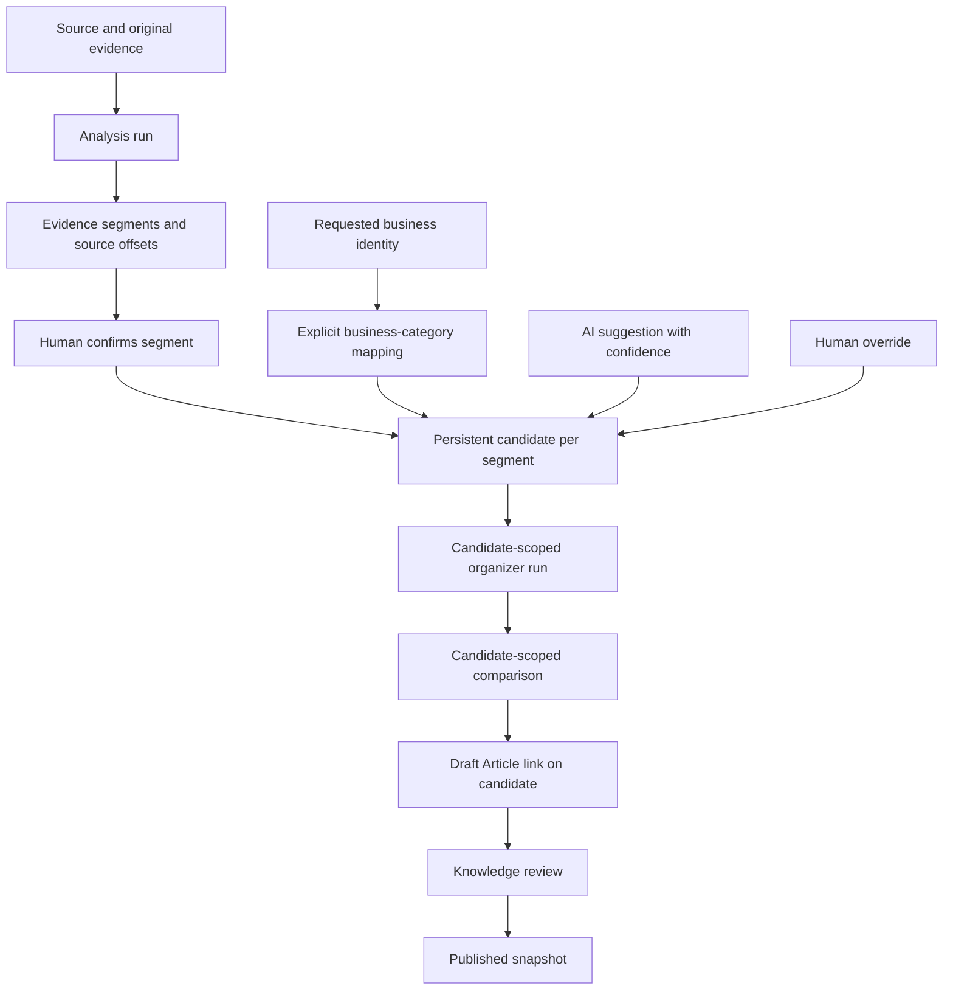

Document status:
CURRENT

Repository:
Darrelkong/crm-system-

Verified branch:
feat/knowledge-smart-ingest-2

Verified HEAD:
d9e94c37fb1af503a116663b8da667db4d7fa6dd

Last architecture verification:
2026-09-26

Production baseline:
main @ a481689ad3854b85dfa6073c9aa495453659fb58

Important:
Feature implementation status and Production deployment status are separate.

Last Human Product Review:
2026-09-26 — CHAT/HUMAN REVIEW COMPLETED; OPEN DECISIONS REMAIN DOCUMENTED

# ECHFRONT CRM — architecture

Current documentation corrected in 0F-B after Chat/Human review (2026-09-26). Open decisions remain documented. Paths describe the verified feature branch. Production observations are the dated 0D/0D-B/0D-C baseline, reused without new Cloudflare queries in this gate. Current source outranks historical architecture prose; deployment metadata does not prove every module's runtime behavior.

Team Member is the user-facing term for internal `staff` identifiers, which remain unchanged. This document describes implementation; [owner-confirmed product rules](CRM_MASTER_SPEC.md) and [implementation gaps/drift](CRM_MODULE_STATUS.md#human-confirmed-rules-versus-implementation-evidence) must be read separately. In particular, 45-day Public Pool protection does not establish the confirmed new-member default-disabled rule, and current 10-character/45-minute follow-up validation does not settle the owner's 5-character baseline.

## Runtime and code organization

The application uses Next.js 16.2.9 / React 19.2.4 App Router, TypeScript, Tailwind 4, Drizzle D1 and OpenNext for Cloudflare Workers. Installed versions observed during takeover included OpenNext 1.19.11, Drizzle 0.45.2 and Wrangler 4.136.1; recheck the lockfile/installed package before future operational work. These are observations, not upgrade instructions.

- [Dashboard routes](../src/app/(dashboard)) render domain UI; [API routes](../src/app/api) call server permission and domain services.
- [Domain libraries](../src/lib) own business workflows, serialization and validation; [permissions](../src/lib/permissions) own shared action guards.
- [DB entry point](../src/lib/db/index.ts) provides request-scoped Drizzle/D1; [schema](../drizzle/schema) and [SQL migrations](../drizzle/migrations) describe persistence.
- [OpenNext configuration](../open-next.config.ts) and [main Wrangler configuration](../wrangler.jsonc) produce/run `.open-next/worker.js` with static assets.
- [Next configuration](../next.config.ts) initializes Cloudflare development bindings. Local test DB binding is explicitly gated; it is not a Production fallback.
- [Legacy code](../legacy) is archival, excluded from the active TypeScript application. Do not revive old Prisma/NextAuth assumptions from historical docs.



The recipient gateway is a separate public-link entry point. It does not require the recipient to log into CRM; CRM authorizes the bearer token through an internal service call before file streaming. The diagram groups scheduled workers: only the backup worker among that group uses `ATTACHMENTS`.

## Production Worker map

This map combines local configuration with the 0D deployment inventory. A configured hostname is not a fresh live DNS/Access verification. Independent Worker bindings were not all queried live in 0D.

| Worker | Source/config | Responsibilities and configured bindings |
| --- | --- | --- |
| `crm-system` | [wrangler.jsonc](../wrangler.jsonc) | OpenNext UI/APIs; `DB`, `ATTACHMENTS`, `LARGE_ATTACHMENTS`, `KNOWLEDGE_SOURCES`, `AI_SERVICE`, `WORKER_SELF_REFERENCE`, `ASSETS`; configured `crm.echfronthk.com`. |
| `crm-ai` | [AI config](../workers/crm-ai/wrangler.jsonc), [entry](../workers/crm-ai/src/index.ts) | Service-only structured AI tasks; `AI` binding, no direct D1/R2 binding; `workers_dev=false`. |
| `crm-system-mail-jobs-cron` | [config](../wrangler.mail-jobs-cron.jsonc), [entry](../workers/mail-jobs-cron.ts) | Mail background work with D1/normal R2, notification `EMAIL` and outbound `BUSINESS_EMAIL`; configured `1-59/3 * * * *` UTC. |
| `crm-system-inbound-mail` | [config](../wrangler.inbound-mail.jsonc), [entry](../workers/inbound-mail.ts) | Receive/stage inbound messages into D1 and normal R2. |
| `echfront-mail-files` | [production config](../wrangler.echfronthk-mail-files.production.jsonc), [entry](../workers/echfront-mail-files/index.ts) | Configured `files.echfronthk.com`; `LARGE_ATTACHMENTS` plus `CRM_SYSTEM` service binding; no D1 binding. |
| `crm-system-backup-cron` | [config](../wrangler.backup-cron.jsonc), [entry](../workers/backup-cron.ts) | Scheduled JSON subset export, D1 and `ATTACHMENTS`; 21:00 UTC daily. |
| `crm-system-reclamation-cron` | [config](../wrangler.cron.jsonc), [entry](../workers/reclamation-cron.ts) | Guarded inactivity/reclamation workflows; D1; 21:00 UTC daily. |
| `crm-system-recycle-cron` | [config](../wrangler.recycle-cron.jsonc), [entry](../workers/recycle-bin-cron.ts) | Recycle-bin retention/purge workflows; D1; 21:30 UTC daily. |

Production versions and release commands are recorded in the [runbook](CRM_DEPLOYMENT_RUNBOOK.md). Deploying `crm-system` does not deploy these other Workers.

## D1 identity and domain map

Production `DB` is `crm-db`, ID `03633dd2-c058-42de-9355-f5450eab7202`, in the verified CRM Cloudflare account `809c05c9f500268e973938fd641eee39`. The config specifies `drizzle/migrations` and no custom `migrations_table`; the installed Wrangler default is `d1_migrations`.

**Production currently stops at migration 0086. Feature branch introduces 0087–0090.** The one approved 0D-C metadata SELECT returned 86 applied rows and no migration after 0090; latest was `0086_knowledge_segment_confirmed_status.sql`, applied at `2026-09-23 14:31:17`. 0084/0085/0086 are APPLIED; 0087/0088/0089/0090 are PENDING. This is a dated result, not authority to repeat the query.

| Domain | Main persisted entities | Boundary |
| --- | --- | --- |
| Identity/security | Users, sessions, authorized devices, login IP/email restrictions | CRM authentication is separate from Access identity. |
| Customers | Customers, contact identifiers/contacts, assignees, households/members/relationships, tags, code counter | Primary owner and assignees must remain consistent; normalized identifier uniqueness. |
| Customer work | Follow-ups, tasks, approvals, notifications, announcements | Scoped workflows and state transitions. |
| Pool/reclamation | Quick-entry submissions/rows, reclamation warning logs, customer pool/claim metadata | Current claim counters derive from customer claim metadata, not an immutable claim ledger. |
| Mail identity/access | User access, mailboxes/members, sender identities/grants, admin grants, receiving addresses, company config | Read, control-plane administration and send-as are separate. |
| Mail content/workflow | Messages/bodies/recipients/read states, drafts/recipients, immutable revisions/recipients, approvals/events, send operations, transport attempts | Durable backend exists even though the UI remains hybrid. |
| Mail ingestion/delivery | Inbound ingestion/materialization, outbound materialization/RFC identities, delivery ingestion/events, notification identities/outbox/attempts | Lease/deduplication/retry state is distinct from successful delivery. |
| Mail files/signatures | Stored files and draft/message/revision links, signature versions/snapshots/assets, large-upload sessions/lifecycle/delivery tokens/acknowledgements | Content bytes live in R2; permission and lifecycle metadata live in D1. |
| Knowledge core | Policy/unlocks/roles, categories, articles/versions, review requests/publications | Live draft state differs from published snapshot state. |
| Knowledge ingest/AI | Sources, organization/comparison/query runs, analysis runs, segments, mappings, candidates | Candidate-scoped additions require pending 0087–0090 in Production. |
| AI operations | Customer insights/feedback, quota/usage events | Customer-provider AI and internal service AI are different integrations. |
| Operations | Audit/field-change/login logs, import/export/backup jobs, system settings | Coverage and retention differ by workflow. |

The feature schema contains 93 declared tables. The 0D D1 metadata count was 92 tables, including platform/system counting differences; these numbers are not a schema equivalence check. No business-table schema/content query was used to resolve that difference.

## R2 bucket map

| Bucket | Current role | Verification limit |
| --- | --- | --- |
| `crm-attachments` | Normal Mail files/raw MIME/signature-related objects and application JSON backup objects, according to respective services | Bucket existence and main binding verified in 0D; object inventory/restore not verified. |
| `crm-mail-large-attachments` | Dedicated large Mail objects, main upload control and public gateway streaming | Existence/main binding verified; physical cleanup, CORS/lifecycle and restore coverage not established. |
| `crm-knowledge-sources` | Original Knowledge files | Existence/main binding verified; source archive is metadata, not object deletion. |
| `crm-knowledge-sources-preview` | Isolated Knowledge Preview originals | Existence verified; Preview data is not Production data. |
| `crm-attachments-preview` | Preview bucket name in several local configs | Configuration reference only; not in the 0D returned bucket inventory. |
| `echfrontcrm` | Additional bucket seen in account inventory | Current application ownership/purpose not established; do not repurpose it. |

Local gateway configuration uses `crm-mail-large-attachments-local` with `crm-system-local`. The main configuration's `preview_bucket_name` for large files equals the Production bucket name: do not infer isolation from the word "preview" or enable remote bindings casually.

## AI task map

The `AI_SERVICE` binding sends bounded task inputs to `crm-ai`; the AI Worker has no database permission of its own. The caller controls retrieval/authorization, and both request/output validation matter.

| Task | Purpose | Current source model/path |
| --- | --- | --- |
| `health_probe`, `structured_probe` | Explicit diagnostics/benchmarks | Qwen default, permitted Llama probe selection. Not safe to run automatically in a read-only gate. |
| `admin_management_brief` | Admin management assistance | Qwen; validated scoped context and output. |
| `staff_today_actions` | Team Member action assistance | Qwen; permitted Team Member context. |
| `knowledge_organize` | Evidence-grounded article draft organization | Qwen plus caller-side grounding/fidelity/quality checks. |
| `knowledge_qa` | Answer using authorized published retrieval | Qwen; publication boundary remains in caller. |
| `knowledge_compare` | Compare draft against visible published candidates | Qwen; candidate snapshot/reference validation. |
| `knowledge_vision_extract` | Supported image extraction | Gemma vision; input validation and usability review. |
| `knowledge_category_suggest` | Suggest existing Knowledge category for business/evidence context | Smart Ingest 2 task; code implemented, Production release pending. |

Current [model constants](../workers/crm-ai/src/models.ts): Qwen `@cf/qwen/qwen3-30b-a3b-fp8`, text probe Llama `@cf/meta/llama-3.1-8b-instruct-fast`, selected vision Gemma `@cf/google/gemma-4-26b-a4b-it`. A second vision constant is not evidence it is selected. Task-level retries/deadlines are bounded; a response deadline does not prove underlying inference cancellation.

Customer insights/follow-up organization also have separate OpenAI-compatible/Gemini provider code in [AI libraries](../src/lib/ai); do not rewrite all AI as one Cloudflare path. Mock output is explicitly gated for development/tests. Production Mock AI must remain off; deterministic dashboard fallback has its own source label.

## Mail architecture

```mermaid
flowchart LR
    Draft[Mutable author draft] --> Revision[Immutable revision and content hash]
    Revision --> Team Member[Team Member approval request]
    Team Member --> Review[Authorized non-self reviewer]
    Revision --> Admin[Authorized Admin direct-send path]
    Review --> Operation[Durable send operation]
    Admin --> Operation
    Operation --> Transport[Mail jobs transport]
    Transport --> Sent[Accepted send and Sent materialization]
    Transport --> Events[Delivery events]
    Receive[Inbound Worker] --> Stage[Raw MIME and staging lease]
    Stage --> Materialize[Inbound materialization]
    Materialize --> Mailbox[Authorized mailbox reads]
```

The [Mail page](../src/app/(dashboard)/mail/page.tsx) combines session, approval, data-source and prototype-shell providers. [Read-source selection](../src/lib/mail/client/mail-read-source.ts) recognizes `NEXT_PUBLIC_MAIL_READ_SOURCE=production`; other values select prototype mode. The canonical Production build forces this setting. This is why Mail is **PARTIAL / HYBRID**, not either wholly fake or wholly finished.

Outbound approval binds to immutable content, recipient/file/signature snapshots and canonical hashing. Provider acceptance, local Sent materialization and recipient delivery events are separate, retryable stages. Team Member authorization cannot be bypassed by changing a UI mode. Notification email and business outbound email use separate bindings on the jobs Worker; the main Worker lacking `BUSINESS_EMAIL` is intentional.

Inbound staging validates targets, preserves raw MIME, uses leases/deduplication and supports quarantine/recovery. Signature HTML is sanitized and versioned. Templates/shared handling/internal notes still have prototype dependencies. Internal read-state persistence does not implement external read receipts or click tracking, and the read-audit hook remains a no-op. Read receipts and LATER auto-reply are **CONFIRMED FUTURE PRODUCT DIRECTION — NOT IMPLEMENTED / NOT RELEASE APPROVED**; external click tracking remains **HUMAN DECISION REQUIRED**, not approved by that direction.

The current ordinary outbound policy caps raw attachments at **3 MiB in aggregate** and validates the full encoded message against a **5 MiB message budget**, including body/headers/MIME and a 32 KiB safety reserve. Do not confuse the raw attachment cap with the encoded-message budget. Large limits are 100 MiB per file, 300 MiB aggregate, and 10 total compose attachments across both kinds. These are code policy values from [outbound size constants](../src/lib/mail/outbound-provider-size-constants.ts) and [large attachment policy](../src/lib/mail/large-attachment/large-attachment-policy.ts), not a newly verified general provider-limit claim.

Large upload flow: authorize owner/draft and generate server-owned object key → signed direct PUT (10-minute URL; Content-Type, Content-MD5, conditional-create headers) → R2 HEAD finalize with size/ETag checks → attach lifecycle metadata → approve/send → issue time-limited recipient delivery token. SHA-256 declared metadata is not independently proven by an ETag; do not document a server SHA-256 guarantee.

Default lifecycle intervals include 24-hour temporary upload retention, a 14-day approval retention cap and seven-day recipient link lifetime. Tokens are random bearer credentials with hashed storage. The gateway asks CRM to authorize the token via a secret-authenticated service call, then streams the private object without exposing a public bucket URL. Range downloads are not supported by the current gateway. Removal/discard cleanup and delivery-token expiration exist; a complete periodic large-object physical cleanup guarantee remains unverified.

## Knowledge architecture

The [source service](../src/lib/knowledge/source-service.ts) enforces source access and archive/retry/confirmation rules. [Extraction](../src/lib/knowledge/source-extraction.ts) uses UTF-8 text/Markdown, Mammoth DOCX text, unpdf text-layer PDF, and supported validated image bytes for vision. Encrypted/unusable/scanned PDFs are not silently converted through an OCR fallback.

File deduplication uses original byte hashes; pasted text uses deterministic layout normalization. It is not semantic deduplication, and file-extracted text is not promised to deduplicate against every paste. Archived duplicate and failed-vision retry behavior have explicit handling. Paste duplicate scanning is a potential scaling concern, not a measured Production incident.

[Organization execution](../src/lib/knowledge/knowledge-organization-execution.ts) validates structured output, evidence grounding, fact fidelity, completeness and article quality. Canonical Simplified Chinese normalization differs from normalized text used for comparison. Original R2 files remain intact; explicit human-reviewed raw-text replacement is allowed and marked, without a complete revision-history guarantee.

[Published retrieval](../src/lib/knowledge/published-retrieval.ts) is limited to role/visibility-authorized published article snapshots. It does not retrieve raw source, customer or Mail tables as Knowledge evidence. Comparison merges bounded candidate retrieval before/after organization, returns visible snapshots and validates referenced candidates. The organizer comparison fingerprint covers normalized title/summary/body; it is not a hash of the entire taxonomy/reference/version graph.

## Smart Ingest lineage and schema split



Each Source may have many confirmed segments/candidates and therefore many draft Articles. Candidate evidence stays within its segment, not the entire Source. `source.linkedArticleId` remains the legacy single-source path; candidate conversion stores its own `draftArticleId` instead. Multi-segment scope blocks inappropriate legacy whole-source organization/comparison.

| Migration | Layer | Meaning | Production at 0D-C |
| --- | --- | --- | --- |
| [0084](../drizzle/migrations/0084_knowledge_smart_ingest_analysis.sql) | Smart Ingest 1 | Analysis runs and source segments; active-run uniqueness. | APPLIED |
| [0085](../drizzle/migrations/0085_knowledge_organization_business_identity.sql) | Smart Ingest 1 | Organization business-identity metadata. | APPLIED |
| [0086](../drizzle/migrations/0086_knowledge_segment_confirmed_status.sql) | Smart Ingest 1 | Rebuild segment status constraint to include confirmed state. | APPLIED |
| [0087](../drizzle/migrations/0087_knowledge_business_category_mappings.sql) | Smart Ingest 2 | Explicit project-code to active Knowledge-category mapping. | PENDING |
| [0088](../drizzle/migrations/0088_knowledge_source_segment_candidates.sql) | Smart Ingest 2 | Persistent per-segment candidate and manual override state. | PENDING |
| [0089](../drizzle/migrations/0089_knowledge_ai_organization_candidate.sql) | Smart Ingest 2 | Candidate-scoped organization runs and uniqueness/index changes. | PENDING |
| [0090](../drizzle/migrations/0090_knowledge_candidate_compare_convert.sql) | Smart Ingest 2 | Candidate-scoped comparison plus draft linkage/conversion time. | PENDING |

Incremental candidate materialization preserves existing candidate state. Refresh hydration is scoped by Source and analysis run. Reorganization preserves an already-linked draft rather than overwriting its Article. Comparison freshness is checked before conversion. Converted active candidates block source reanalysis.

**Known risk:** [candidate conversion](../src/lib/knowledge/knowledge-segment-candidate-convert-service.ts) reads existing linkage, creates an Article, then updates the candidate separately without an atomic compare-and-set tying the steps together. Sequential replay is tested; two simultaneous requests may both create Articles, and a failed link update may leave an orphan. This is a code-observed risk, not a reproduced Production failure. See [P1-01](CRM_IMPLEMENTATION_PLAN.md#p1-01--candidate-conversion-concurrency).

## Preview and local architecture

- Local Next development uses local OpenNext bindings; fixtures/test sessions are not Production records. Local integration harnesses can migrate/write isolated local D1.
- `mail-preview.echfronthk.com` appears in `allowedDevOrigins`; that proves allowed origin configuration, not a live tunnel, Worker or Production-equivalent dataset. Actual tunnel state was not inspected.
- [Knowledge Preview config](../wrangler.knowledge-preview.jsonc) uses `crm-system-knowledge-preview`, D1 `crm-db-knowledge-preview` (`14b75c29-3faf-4389-8aa8-48f06fa75355`) and only `crm-knowledge-sources-preview` R2. It deliberately shares `crm-ai`, so real AI calls are not isolated from the account's AI usage.
- Knowledge Preview has Mock AI off, mail transport disabled, no email binding/cron, and large attachment runtime/send disabled. Its build read-source value is `preview`, which selects prototype Mail, not real Production Mail.
- [Preview deploy guard](../scripts/deploy-knowledge-preview.mjs) allows only `feat/knowledge-human-acceptance-preview` and `fix/knowledge-dedupe-image-extraction`; current Smart Ingest 2 branch is not allowed. Guard changes/deployment require separate scope.
- [Vision local config](../wrangler.knowledge-vision-validate.jsonc) is a limited real-AI local validation path, not full Preview isolation. [Mail test config](../wrangler.mail-test.jsonc) contains Production resource names and must only be used by the verified local-only harness; never infer safe remote targeting.

## Backup and architecture limits

The application JSON exporter includes 26 named tables, excludes sessions/password hashes, and omits Mail, Knowledge, authorized-device state and object bytes. Its existence is not complete recovery. The deployed backup Worker version is older than the audited branch; its exact runtime export coverage was not proved from deployment metadata.

Local D1/R2 files and historical SQL exports are recovery assets, not evidence of a successful full-system restore. A WAL-safe local backup helper exists. Preserve sidecars/local-only assets until separate disposition approval. See [recovery gates](CRM_DEPLOYMENT_RUNBOOK.md#backup-and-recovery-checkpoint) and [P1-02](CRM_IMPLEMENTATION_PLAN.md#p1-02--backuprestore-completeness).
