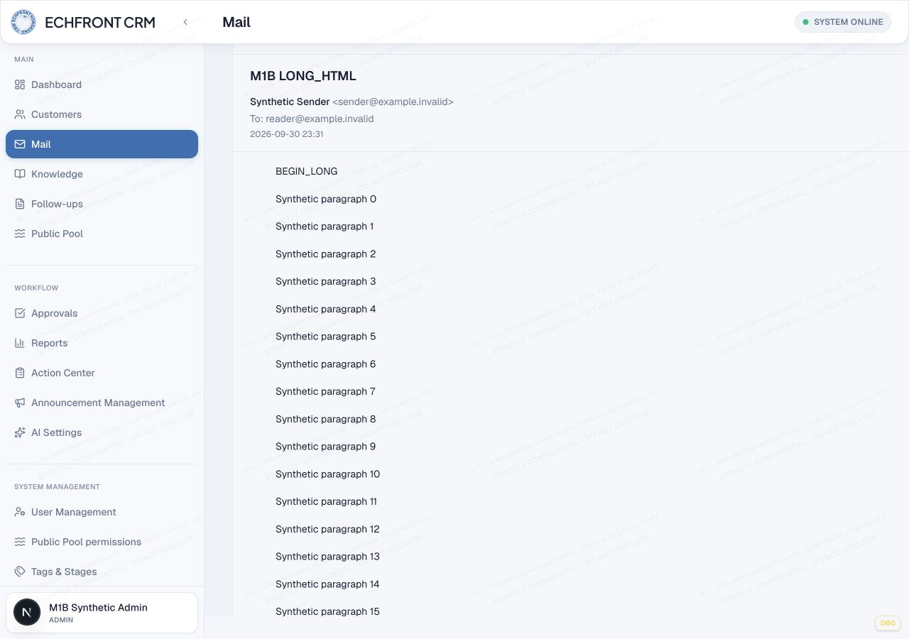
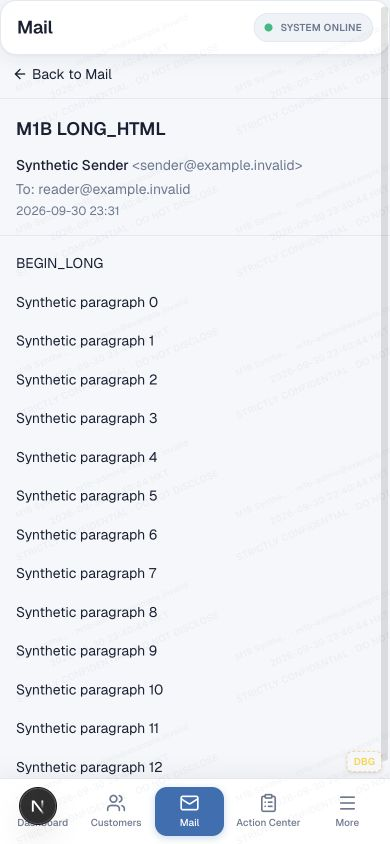
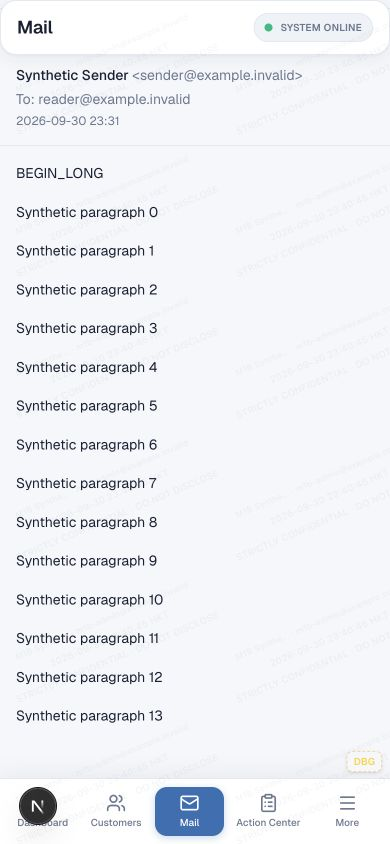
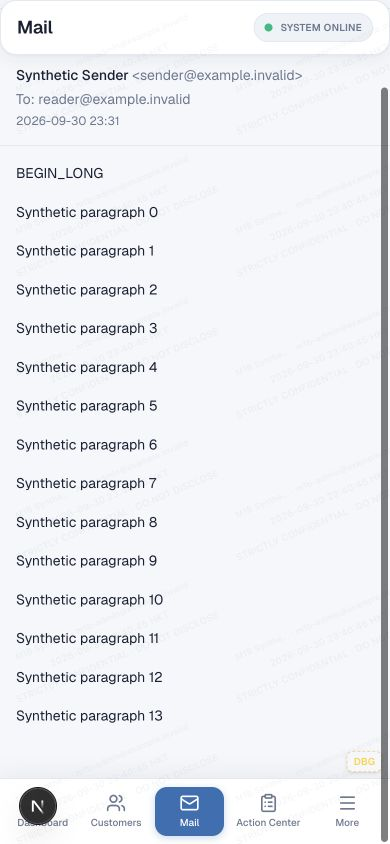

# MAIL M1B — real reader scroll geometry evidence

Evidence date: 2026-09-30. Application baseline: `f5ca38e06fe898faed71d22f2431ae40f18515dd` (main).

**M1B DIAGNOSIS / HARNESS COMPLETE. M1C RUNTIME FIX PENDING.** This is a test-only branch; no production reader, sanitizer, image policy, permissions or infrastructure changed. It grants no deployment authorization.

## Finding

The long-message symptom reproduces in the actual authenticated `/mail` production reading pane at **1280 × 900** and **390 × 844**. Complete final markers exist in persisted sanitized HTML and in the DOM, but ordinary browser scrolling cannot reach them or the attachment/footer below them.

The constrained reading wrapper is `display:block`, despite its own `flex-1` placement in a flex parent. Its child reading pane therefore has no flex-parent height constraint. The pane/article/body expand to content height, while the wrapper clips them with `overflow:hidden`. The intended `overflow-y:auto` body has **equal clientHeight and scrollHeight**, so it cannot scroll. Only the outer document moves: maximum 34px desktop / 95px mobile. This is browser evidence of a broken height propagation chain, not a body-truncation inference.

```text
Dashboard/document (934px desktop / 939px mobile)
  Mail shell (840px / 788px, flex column, overflow hidden)
    Workspace / reading column (bounded flex columns)
      Reading wrapper (791px / 739px, BLOCK, overflow hidden) <-- breaks height constraint
        Production pane (387924px / 387932px, flex column)
          Article (same unbounded height)
            Intended message scroller (387726px, overflow-y auto, NO scroll range)
              Renderer (387600px, full long message remains in DOM)
            Attachment and footer lie below the clipped boundary
```

## Isolation and exercised layers

Preparation reuses installed dependencies and the repository's Wrangler local D1 / platform-proxy pattern. It archives the selected Git HEAD into a new disposable temporary directory; it does not copy private environment files. No package installation is required.

- Local runtime used: `/var/folders/4q/8s0trbh12bs9lmchml8qhkxw0000gn/T/crm-mail-m1b-ZWJBkz`.
- Origin: `http://127.0.0.1:3299/mail`; `NEXT_PUBLIC_MAIL_READ_SOURCE=production` selects the real reader implementation against **local data**.
- D1: dummy UUID `00000000-0000-4000-8000-0000000001b0`, `remote:false`; migrations invoked with `--local` only.
- R2: local emulated `m1b-local-attachments`, `remote:false`; five synthetic text attachments, no remote bucket.
- No service bindings, AI binding, BUSINESS_EMAIL, EMAIL, sender identities, or real customer/message data. Notification transport, outbound transport, verification transport and large-attachment sending are disabled.
- A random-password synthetic Admin gets normal local Mail read membership. Authentication uses the real CRM login form, not a cookie/bypass. Credentials remain only in the runtime's mode-0600 `local-login.json`; never commit or print them.
- Exercised: **synthetic raw MIME → real `parseInboundMimeBytes` → real inbound sanitizer → canonical D1 fixture inserts → normal authenticated Mail read API/data source → actual Mail shell/reading pane**.
- Not exercised: remote inbound Worker, provider staging/queues, materialization-job orchestration, mail delivery. Canonical inserts follow the existing local fixture pattern; this harness does not claim an end-to-end transport test.

Read-only SQLite verification confirmed persisted body hashes match parser output for all six fixtures, `foreign_key_check` returned no rows, and `quick_check` returned `ok`. See [persisted measurements](m1b-evidence/persisted.json) and [fixture manifest](m1b-evidence/fixtures.json).

## Reusable fixture and browser runner

From the harness worktree, with existing `node_modules` available:

```sh
node scripts/mail-reader-geometry/prepare.mjs --local
```

Use the printed temporary directory. Start there with the same sanitized process environment used for this run:

```sh
env -i HOME="$HOME" PATH="$PATH" TMPDIR="$TMPDIR" NEXT_TELEMETRY_DISABLED=1 WRANGLER_SEND_METRICS=false npm run dev -- --webpack --hostname 127.0.0.1 --port 3299
```

The preparation script internally invokes the installed Wrangler CLI as:

```text
node node_modules/wrangler/wrangler-dist/cli.js d1 migrations apply m1b-local --local --config wrangler.jsonc
node --import tsx scripts/mail-reader-geometry/seed.ts --local
```

Use the existing Codex in-app browser, open the localhost origin, authenticate through the normal form using the private fixture file, then open Mail. In the initialized browser automation session, pass its authenticated tab and viewport capability to the exported adapter:

```js
const { runReaderGeometry } = await import('/absolute/harness/path/scripts/mail-reader-geometry/browser-run.mjs');
const fixtures = JSON.parse(await fs.readFile('/absolute/runtime/fixture-manifest.json', 'utf8'));
await runReaderGeometry({ tab, viewport, fixtures, evidenceDir: '/absolute/local/evidence', mode: 'baseline' });
```

`tab` and `viewport` are the existing documented in-app-browser handles, not a new automation framework. The runner requires exactly `http://127.0.0.1:3299/mail` and the six known fixture IDs. It resets viewport afterward. DOM evaluation is read-only. Scrolling uses native documented browser wheel gestures at a point inside the reading body, not forced `scrollTop` writes on an inaccessible overflow-hidden ancestor.

For each viewport/fixture it records top, attempted middle, attempted bottom, then a second maximum-scroll probe. The second probe confirms stable maximum user-scroll position. It saves screenshots, full ancestor-chain geometry and console warnings/errors. It does not apply CSS changes. Run future M1C acceptance with `mode:'fixed'`; this mode must fail on the current baseline.

Recheck captured geometry without rerendering:

```sh
node scripts/mail-reader-geometry/check-results.mjs /absolute/local/evidence/geometry.json baseline
node scripts/mail-reader-geometry/check-results.mjs /absolute/local/evidence/geometry.json fixed
```

The second command currently exits 1 intentionally: the production defect is still present. It is not a passing reader acceptance test.

## Fixture coverage and measured results

| Fixture | Sanitized HTML bytes | Plain text bytes | Content |
|---|---:|---:|---|
| LONG_HTML | 307834 | 237813 | 10003 paragraphs; BEGIN_LONG / MID_LONG / ACTUAL_END_LONG |
| TABLE_NEWSLETTER | 10522 | 7616 | 600px nested-table source, 401 paragraphs, ACTUAL_END_TABLE |
| IMAGE_ONLY_CURRENT_POLICY | 33 | 0 | Remote `.invalid` and CID image markup; current policy removes images |
| QUOTED_LONG | 12563 | 9139 | 482 paragraphs, two nested blockquotes, ACTUAL_END_QUOTED |
| SAFE_WIDE_CONTENT | 10472 | 9285 | Long preformatted text and table, ACTUAL_END_WIDE |
| MALICIOUS_HTML | 59 | 32 | Script/event/iframe/form/SVG/javascript-link source; ACTUAL_END_SAFE |

LONG_HTML MIME is 308041 bytes. Persisted HTML hash equality plus DOM end-marker existence rules out truncation **for these fixtures**. No claim is made about arbitrary external messages or sender layout fidelity; current sanitization is deliberately retained.

| Viewport / fixture | Wrapper client / scroll height | Intended body client / scroll height | Document maximum scrollTop | End reachable |
|---|---:|---:|---:|---|
| Desktop LONG | 791 / 387924 | 387726 / 387726 | 34 | NO |
| Desktop TABLE | 791 / 8207 | 8009 / 8009 | 34 | NO |
| Desktop QUOTED | 791 / 19002 | 18804 / 18804 | 34 | NO |
| Desktop WIDE | 791 / 28500 | 28302 / 28302 | 34 | NO |
| Mobile LONG | 739 / 387932 | 387726 / 387726 | 95 | NO |
| Mobile TABLE | 739 / 8215 | 8009 / 8009 | 95 | NO |
| Mobile QUOTED | 739 / 19010 | 18804 / 18804 | 95 | NO |
| Mobile WIDE | 739 / 37472 | 37266 / 37266 | 95 | NO |
| Both IMAGE_ONLY | Fits | Fits | 34 / 95 | Empty state |
| Both MALICIOUS | Fits | Fits | 34 / 95 | Safe marker, attachment and footer reachable |

All eight long/table/quoted/wide cases also have unreachable attachment/footer sections. At maximum scroll, ACTUAL_END_LONG remains at y≈387807.5 desktop / 387739.5 mobile. The apparent “bottom” screenshot still shows the first paragraphs.

The full LONG ancestor records include tag/classes, bounding rect, client/offset/scroll dimensions, computed height/max-height, overflow axes, display, flex grow/shrink/basis, min-height, position and bottom padding: [long-geometry.json](m1b-evidence/long-geometry.json). All 12 compact assertion results are in [results.json](m1b-evidence/results.json). The raw 12-case measurements and 36 screenshots remain in the disposable runtime's `final-evidence/` directory.

### Mobile navigation and wide content

At the mobile LONG initial capture, Mail shell bottom=838, bottom-nav top=778/bottom=844 (height66): **60px overlap**. At document maximum scroll95, shell bottom=748; overlap has cleared but almost the whole message remains clipped. Navigation is a secondary sizing contributor, not the primary long-body cause. Computed nav bottom padding was8px from `max(0.5rem, env(safe-area-inset-bottom))`; this desktop browser viewport does not prove a physical iPhone inset. A real software keyboard/touch-device interaction was **not tested**.

No horizontal document overflow occurred in any of the 12 cases. `<pre>` independently has a horizontal range (scrollWidth19176 versus clientWidth832 desktop /358 mobile), but no vertical range (clientHeight=scrollHeight=3687). A mobile horizontal gesture moved its scrollLeft from0 to5850 while document width stayed390; see [horizontal evidence](m1b-evidence/wide-horizontal.json). Wide content increases height but does not explain the broken vertical boundary.

### Current image-only and security baseline

IMAGE_ONLY persists `<table><tr><td></td></tr></table>` and empty text. The real resolver/reader displays **“This message has no readable content.”** in both viewports. No image restoration or policy change was made.

MALICIOUS_HTML renders only safe text. DOM probes found no script, event handler, iframe, form, SVG, image or javascript link. Clicking the retained safe text did not set the fixture's execution sentinel. ACTUAL_END_SAFE, its attachment and footer remain reachable; CRM chrome is unaffected. The unsafe link is removed, so there is no executable link to click. [Console capture](m1b-evidence/console.json) contains no warnings/errors during this run. This is a focused safety fixture, not a comprehensive sanitizer security review.

## Hypothesis classification

| Hypothesis | Classification | Evidence |
|---|---|---|
| Workspace/wrapper overflow clips reader | CONFIRMED | 791/739px wrapper clips content hundreds of thousands of pixels tall |
| Non-flex wrapper fails to constrain pane | CONFIRMED, primary | Computed display:block between bounded flex parent and expanding flex child |
| flex-1 body has no usable bounded height | CONFIRMED, primary | Intended scroller's scrollHeight equals clientHeight |
| Competing nested vertical message scrollers | NOT REPRODUCED | Only document responds vertically; inner auto containers have zero range |
| HTML-root overflow | SUPPORTED BUT NOT PRIMARY | Computed auto, but no vertical range; no separate vertical scroll owner |
| Dashboard bottom-nav overlap | CONFIRMED, secondary | Initial60px mobile overlap; long clipping persists after it clears |
| Wide content | SUPPORTED BUT NOT PRIMARY | Local pre horizontal scrolling works; document width remains bounded |
| Body truncation / missing final DOM content | RULED OUT for fixtures | Persisted hashes and end markers match; final markers exist in DOM |
| Removed images cause this text-long clipping | RULED OUT for LONG/TABLE/QUOTE | Reproduction does not depend on image loading |

## M1C production fix contract — proposed, not implemented

Restore a continuous bounded flex-column chain through the reading wrapper and pane. Keep **one primary vertical message scroll owner**; do not merely remove overflow clipping and let an enormous message expand the dashboard document.

Likely narrow runtime targets:

- `src/components/mail/prototype/mail-desktop-workspace.tsx`: reading wrappers around lines295/321 (`min-h-0 min-w-0 flex-1 overflow-hidden`) need a flex-column child constraint.
- `src/components/mail/prototype/mail-prototype-shell.tsx`: mobile reading wrapper around line590 has the same break.
- `src/components/mail/prototype/mail-production-reading-pane.tsx`: pane root/article and intended body around lines191/225/368 need coherent shrink/min-height boundaries; keep header/footer reachable rather than unintentionally shrinking them away.
- Inspect the Mail shell viewport calculation (prototype-shell line508), dashboard Mail layout and `.mobile-bottom-nav` sizing for the measured secondary overlap. Any adjustment must remain scoped to available Mail viewport height; do not broadly rewrite dashboard layout.
- `src/components/mail/mail-message-body-renderer.tsx` / Mail body CSS: preserve separate horizontal handling; change vertical overflow only if the repaired measurements demonstrate it is required. No sanitizer/image/iframe changes belong in M1C.

Acceptance: every long/table/quoted/wide end marker and attachment/footer reachable, intended inner body has usable vertical range, no competing document message scroll, no nav-covered action, no horizontal document overflow, desktop/mobile consistent, no content-length dependence, security and image-only current policy unchanged. Re-measure keyboard/safe-area behavior on a supported real-device path before claiming those covered.

## Validation and inherited test debt

Commands executed:

```sh
node --import tsx --test scripts/mail-reader-geometry/fixtures.test.ts
node --import tsx --test --test-reporter=tap src/lib/mail/client/mail-message-body.test.ts src/lib/mail/inbound-body-html-sanitizer.test.ts src/lib/mail/inbound-mime-parser.test.ts src/lib/mail/client/mail-message-detail-loading.test.ts src/lib/mail/client/mail-desktop-ux-regression.test.ts
node node_modules/typescript/bin/tsc --noEmit --incremental false
node node_modules/eslint/bin/eslint.js scripts/mail-reader-geometry
git diff --check
```

- Six real parser/sanitizer/resolver fixture tests: **6 PASS**.
- Actual browser adapter: six fixtures × two viewports. Latest assertions evaluated against those measured records: **112 PASS / 0 FAIL diagnosis assertions**.
- Future M1C fixed-layout contract against the same records: **24 expected failures**, three per long case (end-marker reachability, inner scroll range, attachment reachability). This explicitly preserves a failing runtime contract for M1C.
- Existing focused reader/body subset: **45 PASS / 1 FAIL** (46 total).
- The inherited failure is `mail-desktop-ux-regression.test.ts`, “moves desktop attachment action to the bottom action bar.” It reproduces against unchanged exact-main test/runtime files. Its source regex expects a literal `submitApproval` within the action-bar block; current code uses `resolveComposeSubmitButtonLabelKey(...)`, while the attachment action is still there. This is unrelated source-regex drift, not a browser harness blocker. M1A's broader64/1 set was not rerun or repaired.
- TypeScript and focused ESLint: PASS. No production source files changed.

## Screenshots (synthetic data only)

Desktop top / attempted middle / attempted bottom:




390px top / attempted middle / attempted bottom:





No MX/DNS/Email Routing change, Production migration, new Mail infrastructure, or real mail send is needed for this proof or the proposed layout correction. Main, accepted feature branches, Production and Cloudflare remain untouched. M1C needs separate authorization.
