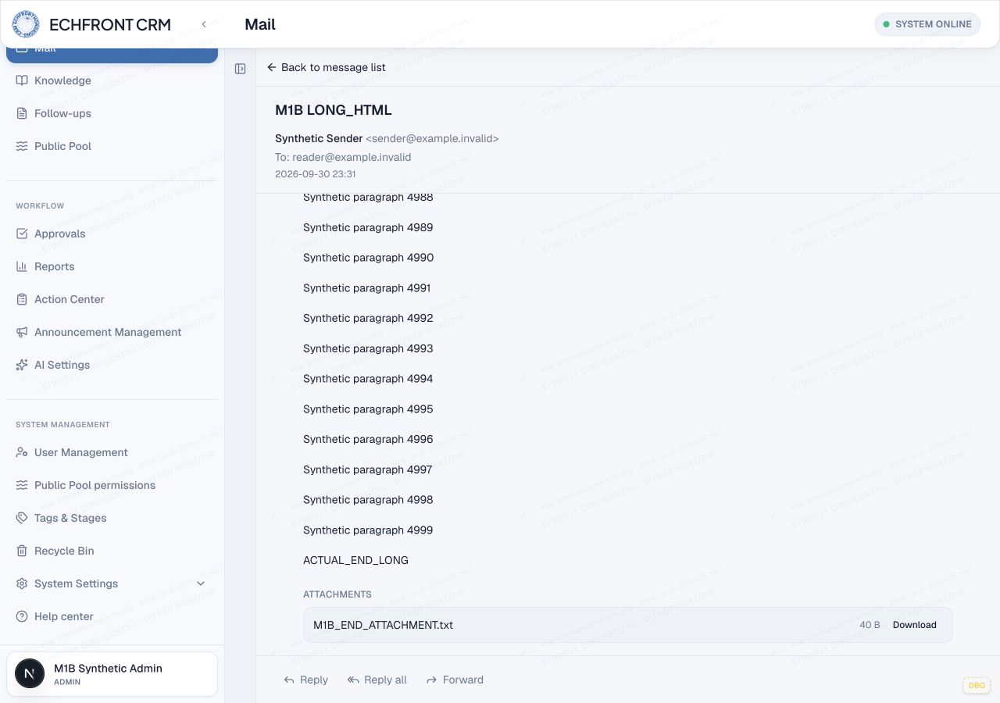
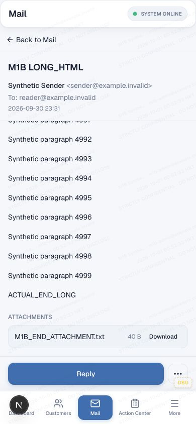

# MAIL M1C — bounded reader layout

2026-10-01. Branch `fix/mail-reader-scroll-geometry`, starting commit `8a316af37cd8740781d1362b4098d49cf9dfa111`; main baseline `f5ca38e06fe898faed71d22f2431ae40f18515dd`.

**M1C LOCAL SCROLL/LAYOUT FIX VALIDATED**

**HTML FIDELITY / IMAGE SUPPORT STILL PENDING**

**NOT MERGED TO MAIN — NOT DEPLOYED**

## Narrow correction

[M1B](MAIL_M1B_SCROLL_GEOMETRY.md) remains the historical diagnosis. Its fixtures, stored bodies and recorded baseline geometry were not shortened or rewritten.

Runtime changes:

- `src/components/mail/prototype/mail-desktop-workspace.tsx`: both reading wrappers are now `flex flex-col`, retaining `flex-1 min-h-0 min-w-0 overflow-hidden`.
- `src/components/mail/prototype/mail-prototype-shell.tsx`: the mobile reading wrapper receives the same bounded flex context.
- `src/components/mail/prototype/mail-production-reading-pane.tsx`: pane states, article and intended body can shrink (`min-h-0 min-w-0`); header/footer remain `shrink-0`. Existing content, attachments and action rendering are unchanged.
- `src/app/(dashboard)/mail/layout.tsx`: adds the `mail-workspace-main` scope class only.
- `src/app/globals.css`: Mail-scoped viewport flex layout uses the header and mobile navigation's actual flow sizes. The mobile navigation becomes relative inside this bounded Mail viewport, retaining its content, appearance, safe-area padding and breakpoint visibility. Mail main removes inherited bottom padding, avoiding double reservation. Its shell uses available height rather than separately subtracting a nominal header. Rules are outside the components cascade layer so responsive utility padding/position cannot override this scoped correction.

No DashboardShell implementation or non-Mail page behavior changed. No JavaScript height observer, timeout, auto-scroll, iframe, content truncation, typography change, sanitizer change or image restoration was introduced. Other Mail pages may scroll within their main area; the reader has one primary message scroller. Desktop list scrolling and wide-content horizontal scrolling remain independent.

## Environment and isolation

Reused M1B runtime and database:
`/var/folders/4q/8s0trbh12bs9lmchml8qhkxw0000gn/T/crm-mail-m1b-ZWJBkz`.
Actual authenticated `/mail` at `http://127.0.0.1:3299`, normal synthetic Admin login, `NEXT_PUBLIC_MAIL_READ_SOURCE=production` selecting the real implementation against local data.

Dummy local D1, emulated local R2, no remote/service/AI/Email bindings; notification, verification and outbound transports disabled. Existing Mail read membership only, no sender identity. No real mail or AI call. Same six MIME/parser/sanitizer fixtures and 40-byte attachment as M1B. No new database, migration or permission change was required.

The local server was restarted with:

```sh
env -i HOME="$HOME" PATH="$PATH" TMPDIR="$TMPDIR" NEXT_TELEMETRY_DISABLED=1 WRANGLER_SEND_METRICS=false npm run dev -- --webpack --hostname 127.0.0.1 --port 3299
```

## Before / after geometry

| LONG_HTML measurement | M1B desktop | M1C desktop | M1B 390px | M1C 390px |
|---|---:|---:|---:|---:|
| Viewport height | 900 | 900 | 844 | 844 |
| Reading wrapper height | 791 | 789 | 739 | 674 |
| Production pane height | 387924 | 789 | 387932 | 674 |
| Primary body clientHeight | 387726 | 591 | 387726 | 468 |
| Primary body scrollHeight | 387726 | 387726 | 387726 | 387726 |
| Body maximum observed scrollTop | 0 | 387135.5 | 0 | 387258.5 |
| Document vertical range | 34 | 0 | 95 | 0 |
| Final marker / attachment / footer reachable | NO | YES | NO | YES |

Rounding explains fractional scrollTop versus integer DOM height differences. Full measured ancestor chain: [long-geometry.json](m1c-evidence/long-geometry.json).

The actual primary scroll owner is the existing reading-body div:
`min-h-0 min-w-0 flex-1 overflow-y-auto px-4 py-4 sm:px-6`.
It is the only ancestor of the message with a usable vertical scroll range. The HTML renderer still has its original styles and complete content.

At 390×844, reader/footer bottom **778px**, navigation top **778px**, navigation bottom **844px**, navigation height **66px**. There is no overlap or extra dashboard bottom-padding gap. Navigation's existing `max(0.5rem, env(safe-area-inset-bottom))` remains authoritative; its actual height is reserved once. At 390×600, the body shrinks to **224px** and the final marker/attachment/footer remain reachable. Desktop navigation is hidden and reserves no space.

No physical touch device, software keyboard or nonzero physical safe-area inset was simulated. Viewport resizing is not evidence of keyboard behavior.

## Real browser results

Six fixtures × desktop1280×900 / mobile390×844, existing Codex in-app browser. Normal wheel gestures inside the reader, no `scrollIntoView`, forced click, DOM style mutation or scripted scrollTop. Geometry and hit testing check that final content and footer actions are unobscured.

| Fixture | Desktop / mobile result |
|---|---|
| LONG_HTML | Actual end, attachment and actions reachable; all10003 paragraphs retained |
| TABLE_NEWSLETTER | End of nested-table message and attachment reachable |
| QUOTED_LONG | End of nested quoted history and attachment reachable |
| SAFE_WIDE_CONTENT | End reachable; no horizontal document overflow; original horizontal pre handling retained |
| IMAGE_ONLY_CURRENT_POLICY | Unchanged: “This message has no readable content.” Deferred image/fidelity work |
| MALICIOUS_HTML | Safe marker readable; sentinel unset after click; no prohibited active elements or external-resource markup |

[Results](m1c-evidence/results.json), [assertion summary](m1c-evidence/summary.json), [console](m1c-evidence/console.json), [persisted body verification](m1c-evidence/persistence.json).

All six persisted HTML SHA-256 hashes and text byte lengths remain identical to M1B. For rendered-content integrity, the harness fingerprints the complete DOM text in-page and compares it to these deterministic ASCII fixtures after the real MIME parser/sanitizer. This avoids the browser tool's200k returned-string truncation and ordinary HTML serialization differences such as implicit tbody. The fingerprint is a regression checksum, not a cryptographic security assertion.

Security/network scope: the malicious fixture has no src/srcset/style/link/object/embed markup in the rendered body, no executable unsafe link, and no script/event execution sentinel. No fixture-origin external resource request or Mail/AI action was observed; no external-resource-capable fixture markup survived. Browser console is clean. This is not a packet-level network audit. Local server logs show bounded user-navigation/detail requests, with no render/request loop.

### Re-entry and shared shell

- Long → short → long: end, attachment and footer reachable each time. Short content has clientHeight=scrollHeight and no forced vertical scrolling.
- Return to Inbox/reopen and reload/reopen: PASS. Selection is existing client state; reload and breakpoint changes can return to list/select-message state, after which normal reopening works. No selection persistence behavior was added.
- Resize390×844 →390×600 →1280×900 →390×844: bounded body and reachable end/footer; [measurements](m1c-evidence/reentry.json).
- Compose opens; controls lie above navigation. No authorized sender exists in this read-only fixture, so Send remains disabled. Returned without sending.
- Mail approvals opens/closes normally and reports an empty review queue. No existing approval record was available for detail-level acceptance; no approval data was fabricated.
- No new React warning, Maximum update depth error or request storm observed.

Early immediate screenshots after large wheel gestures could precede compositor painting. The separately captured settled screenshots below visibly confirm the actual end and controls; DOM geometry alone was not treated as visual proof.




Top and immediate gesture-stage captures are retained in `m1c-evidence/`; raw12-case geometry and all screenshots remain under runtime `m1c-verified-evidence/`.

## Regression harness

`geometry.mjs`, `browser-run.mjs` and `check-results.mjs` now default to **fixed** mode. `baseline` remains explicit historical negative-control mode; M1B evidence remains unchanged. The24 original desired-layout checks now pass, with added footer/action hit tests, one-scroller/document-range checks, external-resource absence and complete-text checks: **158 PASS /0 FAIL** across12 browser cases.

To extend the existing fixture manifest without overwriting it:

```sh
node --import tsx scripts/mail-reader-geometry/fixture-contract.ts "$M1_RUNTIME/fixture-manifest.json" "$M1_RUNTIME/m1c-fixture-contract.json"
```

Pass that enriched manifest to the existing `runReaderGeometry` browser adapter with `mode:'fixed'` (now default). The adapter observes the page after viewport/back navigation before selecting a fixture; no arbitrary sleep or product timing workaround is used. Re-evaluate captured records with:

```sh
node scripts/mail-reader-geometry/check-results.mjs "$M1_RUNTIME/m1c-verified-evidence/geometry.json" fixed
```

## Focused tests / static checks / build

Commands:

```sh
node --import tsx --test --test-reporter=tap src/lib/mail/client/mail-message-body.test.ts src/lib/mail/inbound-body-html-sanitizer.test.ts src/lib/mail/inbound-mime-parser.test.ts src/lib/mail/client/mail-message-detail-loading.test.ts src/lib/mail/client/mail-desktop-ux-regression.test.ts src/lib/mail/client/mail-desktop-folder-return.test.ts scripts/mail-reader-geometry/fixtures.test.ts
node node_modules/typescript/bin/tsc --noEmit --incremental false
node node_modules/eslint/bin/eslint.js scripts/mail-reader-geometry src/components/mail/prototype/mail-desktop-workspace.tsx src/components/mail/prototype/mail-prototype-shell.tsx src/components/mail/prototype/mail-production-reading-pane.tsx 'src/app/(dashboard)/mail/layout.tsx'
git diff --check
```

- Focused tests: **58 PASS /1 inherited FAIL** (59 total, including six fixture tests). No test file skipped.
- Identical named baseline debt: `mail-desktop-ux-regression.test.ts` — “moves desktop attachment action to the bottom action bar”; literal `submitApproval` source regex differs from the existing label resolver. No compose runtime change or corresponding smoke regression; test unchanged.
- Main TypeScript: PASS.
- ESLint:0 errors,10 warnings. The same10 warnings reproduce by linting `git show HEAD:<file>` for the two unchanged-baseline shell/workspace sources; no unrelated cleanup.
- Canonical **`npm run build`: PASS**, Next16.2.9 Turbopack, compiled and generated all routes. Existing middleware-deprecation warning retained.

Build safety: package `prebuild` only generates locales; `build` is `next build`. The build used an isolated source copy with exactly the tested runtime files and the same local dummy config/environment. No deploy command or Cloudflare mutation. Initial default build in the M1B runtime hit Turbopack's external-node_modules-symlink limitation. A supported `--webpack` attempt then encountered the unchanged Knowledge fixture client's `node:path` bundling incompatibility; no source was changed to address it. Copying already-installed dependencies (no installation/upgrade) into a separate disposable build directory allowed the canonical default build to pass:

`/var/folders/4q/8s0trbh12bs9lmchml8qhkxw0000gn/T/crm-mail-m1c-build-iq12ch4r`

```sh
env -i HOME="$HOME" PATH="$PATH" TMPDIR="$TMPDIR" NEXT_TELEMETRY_DISABLED=1 WRANGLER_SEND_METRICS=false npm run build
```

Dev-browser coverage is proven above. **Production-build browser coverage NOT RUN:** repository `next start` exists, but there is no established authenticated local D1/R2 production-serving bridge; `initOpenNextCloudflareForDev` is development-only. No new serving/binding/auth architecture or deployment was introduced for this optional check.

No generated locale changes were copied into the worktree; source/generated hashes were checked after build. Main and other feature branches remain unchanged. Sanitizer/image/CID policy, permissions, stored bodies, read semantics, quoting, signatures, attachments, approvals, schema and transports remain unchanged. This narrow local layout validation is not whole-Mail completion or release authorization.
