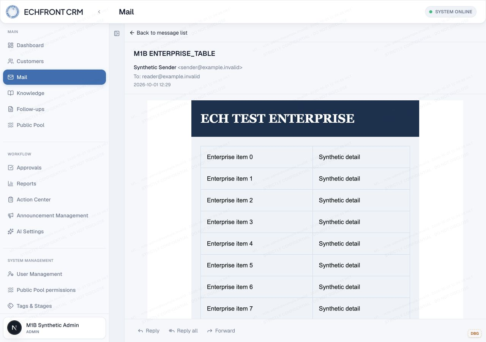
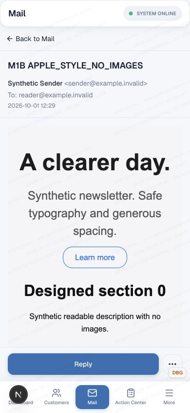
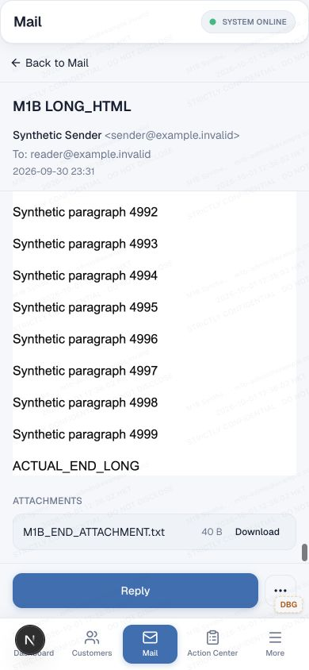

# MAIL M1D — safe HTML fidelity and isolated reader

2026-10-01. `fix/mail-safe-html-fidelity`, based exactly on M1C `4933c5c6d11facbb6424fe052c9835e2f47de5ab`. Main remains `f5ca38e06fe898faed71d22f2431ae40f18515dd`.

**M1D SAFE HTML FIDELITY LOCALLY VALIDATED**

**REMOTE/CID IMAGE SUPPORT PENDING M1E**

**NOT MERGED TO MAIN — NOT DEPLOYED**

## Scope and versioning

M1B/M1C remain historical evidence: [geometry diagnosis](MAIL_M1B_SCROLL_GEOMETRY.md), [bounded scroll fix](MAIL_M1C_READER_SCROLL_FIX.md). M1D does not alter their layout files or recorded results.

The former `inbound-v2` policy removed images, stylesheet blocks/classes, dimensions, cell layout attributes, padding/margin/border and font family. Rendering the remainder directly in CRM's document also applied CRM table, link, heading and paragraph CSS.

`src/lib/mail/inbound-body-html-sanitizer.ts` now exposes **inbound-v3**. The existing materialization service records that value in the existing sanitization-version field for newly materialized messages. No schema/migration, historical rewrite, rematerialization or raw-MIME reconstruction. The six original v2 persisted HTML hashes remain unchanged: [persistence evidence](m1d-evidence/persistence.json). Existing v2 HTML, nested quoted history and a separately created v2-format plain-text compatibility fixture render with the new reader.

### Exact allowed presentation

Allowed elements: `p div span br strong b em i u a ul ol li blockquote pre code h1 h2 h3 h4 h5 h6 table thead tbody tfoot caption hr sub sup tr th td`.

Allowed attributes: inline `style`; anchors `href target rel`; table `width cellpadding cellspacing border align bgcolor`; rows `align valign bgcolor`; cells `colspan rowspan width align valign bgcolor`. Numeric layout attributes are bounded and validated. All other attributes, including sender class/id/events, are removed.

Inline property allowlist:

- width/max-width; width may also be auto;
- nonnegative padding and margins, side-specific padding/margins; auto margins;
- border and side borders with bounded numeric width, solid/dashed/dotted/double and allowed color; border radius, collapse, spacing and table-layout;
- foreground/background color, font family/size/weight/style, line height;
- text-decoration, text-align, vertical-align, white-space, word-break and overflow-wrap.

Values are anchored, finite grammars (px/pt/em/rem/% as applicable). No negative margins, arbitrary CSS functions, CSS variables, viewport sizing, URLs, imports, expressions, behavior/binding, positioning, inset, z-index, transform, opacity, display-hiding, overflow clipping or animations. Height declarations/attributes remain stripped; none was necessary for the accepted fixtures.

Font families are restricted to Arial, Helvetica, Verdana, Georgia, Tahoma, Trebuchet MS, Times New Roman, Courier New, sans-serif, serif, monospace and system-ui fallback lists. Colors accept the named basic palette, hex and numeric rgb/rgba/hsl/hsla forms. This is deliberately less than full CSS.

**CSS safety gate:** installed `sanitize-html` already parses inline declarations through PostCSS before applying `allowedStyles`. The new regular expressions are property-value allowlists within that existing parser, not an invented stylesheet parser. Arbitrary sender `<style>` blocks/classes, selectors and media queries remain removed. No new dependency. Responsive stylesheet fidelity remains debt; inline percentages/max-width work.

## Isolation and links

Runtime files:

- `src/lib/mail/inbound-body-html-sanitizer.ts`
- `src/components/mail/mail-message-body-renderer.tsx`
- new `src/components/mail/mail-isolated-html-document.tsx`
- new `src/lib/mail/client/mail-isolated-document.ts`

Only server-sanitized canonical HTML is wrapped in a document and passed to iframe `srcDoc`. No raw MIME path or client sanitizer was introduced. Plain text and empty-state resolution are unchanged.

The iframe uses **sandbox="allow-same-origin" only**, `referrerPolicy="no-referrer"`, no scripts/forms/popups/top-navigation permissions, and no sender embedded frames. Same-origin access is needed by trusted parent measurement, not by sender code. The design follows the [documented script-disabled same-origin measurement boundary](https://developer.mozilla.org/en-US/docs/Web/HTML/Reference/Elements/iframe); `allow-scripts` is never combined with it.

The document starts with a deny-network CSP:

```
default-src 'none'; script-src 'none'; style-src 'unsafe-inline';
img-src 'none'; font-src 'none'; connect-src 'none'; media-src 'none';
frame-src 'none'; object-src 'none'; base-uri 'none'; form-action 'none'
```

The only document stylesheet is application-owned: neutral white background, dark text, local Arial fallback, normal flow and hidden internal overflow. Sender inline styles remain subject to server policy. CRM styles do not cross the document boundary; existing CRM watermark/chrome remains outside and intact.

Trusted parent click handling cancels default frame link navigation. Only deliberate trusted clicks on absolute HTTP(S), mailto or tel links can open separately with noopener/noreferrer. Unsafe/relative schemes are removed or refused; sender top-level targets never gain navigation permission. Existing v2 links receive the same handling. No automatic link request. External-destination browsing itself was not performed during this local-only test.

## Sizing and M1C regression

Trusted parent `ResizeObserver` watches the host and document body; updates are coalesced through requestAnimationFrame and cleaned up on document replacement/unmount. The iframe height is the measured natural body height, not a fixed viewport height. Width is recomputed on host-width changes, with wide content handled in a separate horizontal host. Height writes occur only when the measured value changes. No script or postMessage sizing code runs inside sender HTML, no polling/timer and no client re-sanitization.

The existing M1C body remains the sole primary vertical scroller. The iframe has no internal vertical range. All four M1B long/table/quoted/wide fixtures and three new fidelity/security fixtures were tested at 1280×900 and 390×844, along with existing image-only and malicious HTML fixtures: **18 cases, 288 PASS / 0 FAIL**.

| Fixture / measure | Desktop | 390px |
|---|---:|---:|
| Outer reader clientHeight | 591 | 468 |
| LONG_HTML isolated document height | 400104 | 400104 |
| LONG_HTML final marker top/bottom | 708 / 726 | 578 / 596 |
| Enterprise document height | 4761 | 4809 |
| Apple-style document height | 3973 | 4777 |
| Inner document vertical range | 0 | 0 |
| Outer document overflow | none | none |
| End + applicable attachment/footer/actions | reachable | reachable |

The LONG_HTML height differs from M1C because neutral document typography replaces CRM typography; content fingerprints and all original stored hashes match. Content was not shortened. Native wheel gestures reach the bottom; no scripted scrollTop or scrollIntoView proof. Wide unbroken text remains horizontally scrollable without widening the CRM document.

At 390×600, the outer body is 224px high and the final marker, attachment and footer remain reachable. Resize/re-entry, reload/reopen, long→plain→table switching passed. Existing shell selection may clear across breakpoint/reload; normal reopening works, as recorded in M1C. No selection-persistence change.

The browser tool centers frames when performing frame-scoped inspection. The harness therefore reads static inner geometry before user scrolling, then inspects outer DOM only after scrolling. An initial 28-failure measurement run was caused by that probe moving the page; no product workaround was added. The corrected run preserves all end/attachment assertions. Immediate compositor captures may precede paint; settled visual evidence is included below.

## Fidelity, security and performance evidence

- Enterprise: nested structure, 600px desktop table / constrained mobile max-width, 24px padding, navy/gray backgrounds, borders, 32px Georgia heading retained. CRM table-width and cell-padding rules do not apply.
- Apple-style: 48px heading, 24px text hierarchy, generous spacing and text-only bordered button retained. No claim of pixel-perfect Apple/Gmail equivalence.
- Malicious HTML/CSS: script/event/form/iframe/object/embed/image/unsafe-link elements absent after server sanitization; click sentinel stays unset; CRM route unchanged and chrome interactive. Fixed-position/z-index/URL/import/expression attempts removed.
- Browser resource inventory records 71 cumulative observed resources, all local CRM resources; no fixture network canary. Local server request log records zero `/m1d-network-canary/*` requests. Neither CSS/import nor image loading occurred. [Observed browser resources](m1d-evidence/browser-resources.json), [local request counts](m1d-evidence/server-requests.json). This is browser/resource and local-server evidence, not packet capture.
- Detail GETs correspond to fixture visits; four per original fixture across two full diagnostic/regression runs. No automatic send/AI request or request storm. Console captured no errors/warnings. No resize-observer or React loop observed through switching/reload/resize and subsequent inspection.
- Warm fixture-open timings in the final run: approximately 644–1462ms, including automation and screenshot synchronization. These are local functional observations, not a production latency benchmark.
- Existing image-only message still displays “This message has no readable content.” Images/CID/data images, background images and alt-placeholder semantics remain deferred to M1E. No misleading replacement image was created.
- Plain text remains text (including literal `<not-html>`), no iframe required. No old body was rewritten.

[Assertions](m1d-evidence/summary.json), [geometry/styles](m1d-evidence/results.json), [console](m1d-evidence/console.json), [reduced height](m1d-evidence/reduced-height.json).





## Reproduction and validation

Same M1B disposable runtime: `/var/folders/4q/8s0trbh12bs9lmchml8qhkxw0000gn/T/crm-mail-m1b-ZWJBkz`, HTTP127.0.0.1:3299, normal synthetic Admin login, real Mail production-read-source implementation with dummy local D1 and emulated local R2. No service/AI/Email bindings; all transports disabled.

```sh
# In exact disposable runtime only; refuses unexpected config or existing IDs:
env -i HOME="$HOME" PATH="$PATH" TMPDIR="$TMPDIR" WRANGLER_SEND_METRICS=false node --import tsx scripts/mail-reader-geometry/seed-fidelity.ts --local
env -i HOME="$HOME" PATH="$PATH" TMPDIR="$TMPDIR" WRANGLER_SEND_METRICS=false node --import tsx scripts/mail-reader-geometry/seed-fidelity.ts --local --plain-only
# Server:
env -i HOME="$HOME" PATH="$PATH" TMPDIR="$TMPDIR" NEXT_TELEMETRY_DISABLED=1 WRANGLER_SEND_METRICS=false npm run dev -- --webpack --hostname 127.0.0.1 --port 3299
```

Use `runFidelity` from `scripts/mail-reader-geometry/fidelity-browser.mjs` with the existing browser adapter, viewport capability, M1C enriched six-fixture manifest plus the three M1D fixtures and their parsed-body text fingerprints. Original fixtures/manifests are retained, not regenerated under v3.

```sh
node --import tsx --test src/components/mail/mail-isolated-html-document.test.ts src/lib/mail/inbound-body-html-fidelity.test.ts src/lib/mail/inbound-body-html-sanitizer.test.ts
node --import tsx --test src/lib/mail/inbound-mime-parser.test.ts src/lib/mail/outbound-body-html-sanitizer.test.ts src/lib/mail/client/mail-message-body.test.ts src/lib/mail/client/compose-reply-body.test.ts src/lib/mail/client/mail-compose-reply-regression.test.ts src/lib/mail/client/mail-message-detail-loading.test.ts src/lib/mail/client/mail-desktop-ux-regression.test.ts
node node_modules/typescript/bin/tsc --noEmit --incremental false
node node_modules/eslint/bin/eslint.js src/components/mail/mail-isolated-html-document.tsx src/components/mail/mail-isolated-html-document.test.ts src/components/mail/mail-message-body-renderer.tsx src/lib/mail/inbound-body-html-sanitizer.ts src/lib/mail/inbound-body-html-fidelity.test.ts src/lib/mail/client/mail-isolated-document.ts scripts/mail-reader-geometry/fidelity-browser.mjs scripts/mail-reader-geometry/fidelity-fixtures.ts scripts/mail-reader-geometry/seed-fidelity.ts
git diff --check
```

- New component/fidelity tests:18 new tests plus five existing sanitizer tests = **23 PASS**.
- Adjacent existing tests: **57 PASS / 1 inherited FAIL**, unchanged “moves desktop attachment action to the bottom action bar” literal-source-regex debt. No test removed/weakened. Outbound sanitizer and compose quote tests pass; inbound formatting does not expand outbound policy.
- TypeScript and focused ESLint pass.
- Canonical `npm run build` passes in isolated source copy `/var/folders/4q/8s0trbh12bs9lmchml8qhkxw0000gn/T/crm-mail-m1d-build-uh3lb7cp`, using identical runtime sources, dummy config and safe environment. Existing installed dependencies were copied, never installed/upgraded. The first copy from the older temporary M1C build lacked esbuild files; copying the intact installed dependency tree resolved that environment-only build failure. Existing middleware deprecation warning remains.

```sh
env -i HOME="$HOME" PATH="$PATH" TMPDIR="$TMPDIR" NEXT_TELEMETRY_DISABLED=1 WRANGLER_SEND_METRICS=false npm run build
```

No built-app authenticated browser bridge was introduced. Browser evidence is Next dev with the actual local data source. Physical touchscreen/software keyboard, nonzero physical safe-area inset, and additional browser engines remain untested. Local iframe `ResizeObserver`/srcdoc support was verified in the existing Codex browser only.

## Deferred boundaries

M1E owns remote/CID images, image-only/alt semantics and privacy controls. M1F owns quote fidelity; outbound/signature/approval/attachment policy is unchanged. Historical reprocessing is a separate decision and cannot assume raw MIME still exists. Stylesheets/media queries remain deferred. No Production D1, deployment, DNS/Email Routing, Cloudflare, external Mail/AI action, permission change or schema migration occurred. Main and M1C branch remain unchanged. This document grants no release authorization.
