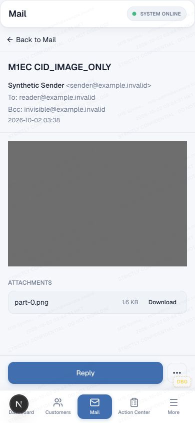
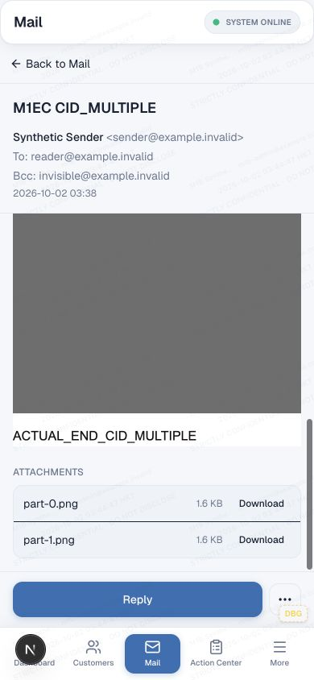

# MAIL M1E-C — durable, authorized CID inline images

2026-10-02. Branch `fix/mail-cid-inline-images`, based exactly on M1E `2fc40c437688a5d09fcd3b9d3b026928b2b1875c`. Main remains `f5ca38e06fe898faed71d22f2431ae40f18515dd`. This document records the local candidate delivered in the same commit; it does not authorize a release.

**M1E CID INLINE IMAGES LOCALLY VALIDATED**

**MIGRATION 0092 NOT APPLIED TO PRODUCTION**

**NOT MERGED TO MAIN — NOT DEPLOYED**

The [M1E evidence](MAIL_M1E_IMAGE_PRIVACY_AND_CID.md) remains the historical no-schema remote-image baseline. The separately owner-approved M1E-B design places MIME-part metadata on the message attachment, not reusable file bytes. No separate table, backfill, public gateway, image proxy, sender-trust model or outbound-policy expansion was introduced.

## Durable schema and normalization

`drizzle/migrations/0092_mail_message_attachment_cid_metadata.sql` adds exactly:

- Nullable `content_id_normalized TEXT COLLATE BINARY`: NULL or 1–998 printable ASCII characters, no angle brackets or NUL.
- Nullable `content_disposition TEXT`: NULL, `inline` or `attachment`.
- Nonunique partial index `idx_mail_message_attachments_message_cid(message_id, content_id_normalized COLLATE BINARY)` for non-NULL IDs.

No table rebuild, renumbering or migration0093. Existing message/file/revision composite foreign keys and attachment IDs, sort order and stored-file identity remain intact. All existing rows retain NULL/NULL. Drizzle uses SQLite's default BINARY text collation and an explicit BINARY index expression, with matching checks.

Shared `src/lib/mail/cid-image.ts` defines **cid-v1**. The supported subset is case-sensitive ASCII dot-atom `local@domain` syntax; quoted/obsolete/domain-literal and other unsupported complex forms fail closed.

| Input | Rule |
|---|---|
| MIME Content-ID header | Trim only outer ASCII space/tab; remove one surrounding balanced `<...>` pair; do not percent-decode; preserve case, literal `+` and `%` |
| HTML reference | Recognize `cid:` case-insensitively; decode payload exactly once with `decodeURIComponent`; `+` remains `+`; validate without repair or truncation |
| Invalid | Empty, overlong, non-ASCII, controls, internal whitespace, malformed bracket/atom structure → NULL/unavailable |

For example, header `<Foo+%40@Example>` matches HTML `cid:Foo%2B%2540%40Example`. It does not match a different case. The database deliberately accepts a broader printable field envelope than the conservative application syntax; every read resolver validates supported syntax again.

## Write, replay and historical boundary

PostalMime supplies Content-ID, effective disposition, MIME, filename, bytes and order. `inbound-mime-parser.ts` no longer broadly trims Content-ID; the shared helper owns normalization. `inbound-message-materialization-service.ts` persists normalized CID/effective disposition on each `mail_message_attachments` row. Missing disposition remains the existing effective `attachment` value. Missing/invalid CID is NULL.

The canonical semantic graph includes both fields. Same-ingestion replay returns canonical identity; equivalent RFC Message-ID arrivals converge; CID/disposition disagreements reject rather than overwrite. Duplicate CIDs remain distinct rows, including differing dispositions/MIME types. A forced local transaction failure rolls back message/body/link/materialization graph, and retry succeeds. Existing private object staging/lifecycle behavior is unchanged.

Before ingestion claim or attachment writes, a qualified zero-row SELECT checks both0092 columns. Qualification is intentional: SQLite can interpret an unqualified missing double-quoted identifier as a string. New code on0091 therefore fails explicitly before ingestion side effects. Message-detail joins also require the new columns; there is no silent old-schema fallback or automatic migration.

Existing inbound-v2/v3/v4 bodies are not rewritten. No raw MIME reparsing or filename-derived mapping. Old NULL CID rows stay unavailable for inline lookup while ordinary attachments and stored bodies keep their existing behavior. Optional historical recovery remains a separate decision.

## Sanitizer and reader contract

New materialization records **inbound-v5**. Valid CID `` becomes inert `span[data-mail-cid-v1]`, containing a validated percent-encoded JSON tuple `[normalizedCid, alt, width, height]`. Alt is bounded to500 characters; dimensions are optional integers1–2000. There is no src, message ID, attachment ID, object key, external URL, srcset or sender event handler. Reserved descriptors revalidate on sanitization. Malformed CID input becomes escaped unavailable text, never a browser `cid:` request.

Valid CID descriptors count as meaningful body content even without alt/text. Empty, invalid or commented descriptors do not override the plain-text fallback. Remote HTTP(S) descriptors retain the M1E contract unchanged.

After message authorization, the existing attachment query supplies a single message-scoped resource map. All CID rows are counted **before** MIME/disposition/scan eligibility: zero or multiple matches → unavailable; exactly one may resolve. There is no first-match, inline-preferred, filename, order or cross-message fallback. The serialized map includes only body/quoted-body references and attachment IDs, never object locators or unrelated CIDs. It is bounded to256 distinct references; excess references safely remain unavailable. Repeated references reuse the same resource identity.

Trusted application code receives the map separately from sanitized sender HTML and constructs the internal endpoint URL. Missing/ambiguous/denied/missing-object/bad-byte resources retain a visible localized unavailable placeholder. en/zh-Hans/zh-Hant use the canonical translator/catalog. The initially script-disabled iframe still has only `sandbox="allow-same-origin"`; no scripts/forms/top-navigation/popups. CSP permits same-origin images only when the authorized map contains an eligible CID, while all other resources remain denied. Remote origins are added only through the unchanged explicit per-view opt-in. Sender markup cannot provide an application URL.

CID images use `no-referrer`, max-width100% and proportional height. The existing parent ResizeObserver/rAF measures image layout changes; the M1C outer body remains the sole vertical message scroller. There is no sender script, height polling or postMessage protocol.

## Private delivery and authorization

`GET /api/mail/messages/{id}/inline-resources/{attachmentId}?folder=...`:

1. Normal CRM/Mail actor authentication and Mail access gate.
2. Existing active mailbox/member/Admin and message visibility/folder/trash authorization.
3. Exact attachment ID **and current message ID** match.
4. Same-message case-sensitive CID count must equal one, before filtering.
5. Reuse existing downloadable-file relationship/hash, size, R2-provider and scan/delivery eligibility checks.
6. Read private bytes through the existing R2 byte reader; require matching declared PNG/JPEG and existing byte-signature validation.

Success is inline, `private, no-store`, `nosniff`. Missing/ineligible resources fail closed; invalid signatures return415. SVG/HTML/PDF/other MIME, mismatched MIME, blocked/scan_failed files, missing objects, guessed IDs and wrong-message attachments never deliver inline bytes. These are signature and access checks, **not a claim that malware scanning occurred**. Existing unscanned-file policy is not expanded. No public object URL, proxy, object-key response or new infrastructure.

Local tests cover unrelated actors, disabled Mail access, owning the wrong mailbox, inactive mailbox, wrong inbox/sent/trash context, wrong-message attachment, stored-file/CID/guessed-ID knowledge, and existing Bcc visibility for an authorized non-owner member. The server enforces these boundaries independently of the UI.

## Local migration and service evidence

`cid-local-d1.ts` creates disposable `crm-mail-cid-test-*` environments with a dummy D1 identity, `remote:false`, no other bindings, no transport and scrubbed CLI environment. Only installed Wrangler `--local` is used. No live account/resource queried.

| Gate | Result |
|---|---|
|0091→0092|PASS|
|0086→0087→0088→0089→0090→0091→0092|PASS|
|Exact migration tracking; existing rows/body unchanged|PASS|
|Old explicit-column inserts on0092 produce NULL/NULL|PASS|
|New materializer on0091 fails readiness|PASS|
|Valid values, duplicates allowed, invalid values rejected, case-sensitive lookup|PASS|
|Partial index selected by EXPLAIN QUERY PLAN|PASS|
|Existing composite FKs and foreign_key_check|PASS|
|D1 quick_check; closed local SQLite read-only integrity_check|ok / ok|
|Parser/materialization/replay/authorization/byte delivery|19 tests PASS|

D1's API permits quick_check but rejects integrity_check. Full integrity was therefore checked through Python SQLite in read-only mode against the closed, disposable local database file. No direct file access to Production or the browser fixture DB was used.

## Browser and network evidence

Reused M1B runtime `/var/folders/4q/8s0trbh12bs9lmchml8qhkxw0000gn/T/crm-mail-m1b-ZWJBkz`, normal synthetic Admin login, actual `/mail` at127.0.0.1:3299, production-read-source implementation backed by local dummy D1 and emulated private R2. Seeder verifies exact local config, no service/AI/Email bindings, no transport. Existing historical messages were retained. Eight new fixtures pass real MIME→staging→parser→sanitizer→materializer→D1/private local R2→authenticated API→reader. No mail was sent.

| Browser gate at1280×900 and390×844 | Result |
|---|---|
|CID_SINGLE / MULTIPLE / MISSING / DUPLICATE / IMAGE_ONLY / MIXED_TEXT / WRONG_MESSAGE / BAD_BYTES|16 cases, **194/194 assertions**|
|M1E remote privacy regression|18 cases, **300/300 assertions**|
|M1C/M1D LONG_HTML / QUOTED_LONG / enterprise / Apple-style / historical empty / malicious HTML|12 cases, **180/180 assertions**|
|Remote canary requests before opt-in|**0**|
|After opt-in in remote regression|**20 expected /20 observed**, no unexpected paths/referrers|
|Mixed CID+remote additional smoke|Private CID loads initially; one explicit click causes exactly one `/banner.png` loopback request, no referrer|
|Active sender content, top navigation, CRM CSS escape|None observed|
|Reload/reopen, desktop↔390 resize, reduced390×600 height|PASS; no render/ResizeObserver loop|

CID_MULTIPLE outer scroll clientHeight/scrollHeight/maximum scrollTop: desktop **567/1541/974**, mobile **444/1033/589**. The isolated document has no competing vertical range. Final markers and footer controls pass visibility/hit tests, attachments remain reachable, and the390px navigation starts at778 within844px. No document horizontal overflow. At390×600, the mixed fixture has one outer range **200/748/548**, with document390×600; end controls remain reachable.

The same CID referenced twice uses one endpoint identity and the browser coalesces its initial bytes. Explicit remote opt-in and breakpoint remount can reload private no-store bytes; this is bounded per-view work, not a loop. Ordinary health/session checks remain. The final closeout has zero Maximum-update-depth/render-phase/ResizeObserver warnings. Bad-byte fixtures intentionally yield415 and unavailable UI. A transient Next dev JSON-manifest error during an earlier remote run cleared on restarting the same local server; both full final remote runs passed. An initial fidelity probe used a manifest without its historical text fingerprint; the completed run uses the preserved accepted fingerprints, with no content/check removed.

[Summary](m1ec-evidence/summary.json), [CID geometry/security assertions](m1ec-evidence/cid.json), [remote request evidence](m1ec-evidence/remote.json), [preserved scroll/fidelity](m1ec-evidence/fidelity.json), [reload/resize/mixed-image closeout](m1ec-evidence/closeout.json). Extracts retain all assertions and relevant geometry; full raw JSON/screenshots remain in the disposable runtime. Legacy fidelity probe counters classify all img elements as resources; CID security uses its dedicated active-content predicate and exact internal URL assertions.




The gray PNG is deliberately generated synthetic data (600×420). Browser coverage uses the existing Codex in-app browser/Next dev. Physical touch/keyboard, nonzero physical safe-area inset, other browser engines and authenticated production-build browser serving are not claimed. The canonical build passes separately; no new production-serving/auth bridge was invented.

## Validation commands and known debt

```sh
# Disposable runtime only, exact existing dummy config and local R2:
env -i HOME="$HOME" PATH="$PATH" TMPDIR="$TMPDIR" WRANGLER_SEND_METRICS=false node node_modules/wrangler/wrangler-dist/cli.js d1 migrations apply m1b-local --local --config wrangler.jsonc
env -i HOME="$HOME" PATH="$PATH" TMPDIR="$TMPDIR" WRANGLER_SEND_METRICS=false node --import tsx scripts/mail-reader-geometry/seed-cid.ts --local
env -i HOME="$HOME" PATH="$PATH" TMPDIR="$TMPDIR" NEXT_TELEMETRY_DISABLED=1 WRANGLER_SEND_METRICS=false npm run dev -- --webpack --hostname 127.0.0.1 --port 3299

node --import tsx --test --test-reporter=tap src/lib/mail/schema/mail-cid-migration-d1.integration.test.ts
node --import tsx --test --test-reporter=tap src/lib/mail/cid-materialization.integration.test.ts
node --import tsx --test src/lib/mail/cid-image.test.ts src/lib/mail/inert-image.test.ts src/lib/mail/inert-image-locales.test.ts src/lib/mail/inbound-body-html-fidelity.test.ts src/lib/mail/inbound-body-html-sanitizer.test.ts src/lib/mail/client/mail-message-body.test.ts src/components/mail/mail-isolated-html-document.test.ts scripts/mail-reader-geometry/fixtures.test.ts src/lib/mail/inbound-mime-parser.test.ts src/lib/mail/outbound-body-html-sanitizer.test.ts src/lib/mail/client/compose-reply-body.test.ts src/lib/mail/client/mail-compose-reply-regression.test.ts src/lib/mail/client/mail-message-detail-loading.test.ts src/lib/mail/client/mail-desktop-ux-regression.test.ts src/lib/mail/inbound-canonical-semantic.test.ts
node node_modules/typescript/bin/tsc --noEmit --incremental false
git diff --check
```

The browser adapter runs `runCidBrowser` from `cid-browser.mjs`, `runImagePrivacy` from the unchanged M1E harness, and `runFidelity` with accepted historical fingerprints. No browser dependency installed. Local request canary is127.0.0.1:3399, generated PNG only, no upstream fetch.

- Focused combined units: **134 PASS /1 inherited FAIL,135 total**. Migration2/2 and service/D1/auth19/19 separately pass. New CID unit contract covers26 cases; existing canonical-semantic fixtures are extended with nullable fields, and the3 real translator/catalog tests now cover the inline-unavailable key too.
- Named debt remains unchanged: `mail-desktop-ux-regression.test.ts`, “moves desktop attachment action to the bottom action bar.” Its source regex expects literal submitApproval; compose source and that test are unchanged. No new related runtime regression, deletion or weakening.
- TypeScript noEmit, focused ESLint on changed TS/TSX/MJS files, diff check: PASS.
- Canonical `npm run build`: PASS, Next16.2.9. Existing middleware deprecation only. As in M1C/M1D/M1E, external node_modules symlinks fail Turbopack; the successful build uses an isolated source copy and copied installed dependencies, without installation/upgrade: `/var/folders/4q/8s0trbh12bs9lmchml8qhkxw0000gn/T/crm-mail-m1ec-build-f9f2i05j`. `prebuild` generates locales and `build` is only `next build`, with the same dummy config and scrubbed environment. No deploy hook.
- Source/generated locale parity retained. No package/dependency change.
- Outbound sanitizer/reply tests pass; inbound descriptors and trusted renderer URLs are not written back to canonical HTML or sent as outbound images. Signatures/approval/attachment inclusion behavior is untouched. Quote fidelity remains M1F scope.

## Compatibility, release order and recovery

Old app +0092: additive nullable fields preserve existing explicit writes, but old materializers do not capture CID metadata. New app +0091: unsupported, deliberately fails before inbound mutation; future authorized release must apply/verify0092 before activating new application/ingestion code. The local test is not evidence of live Production migration state.

No down migration or destructive rollback is proposed. If application rollback is required in a separately authorized release, retain additive columns/data; the old renderer may not display v5-only CID content and old materialization will not capture new metadata. Use a forward fix to restore functionality; do not delete new mappings, fabricate old mappings or reprocess historical MIME automatically. No Production migration/deploy or main promotion is authorized by this evidence.
