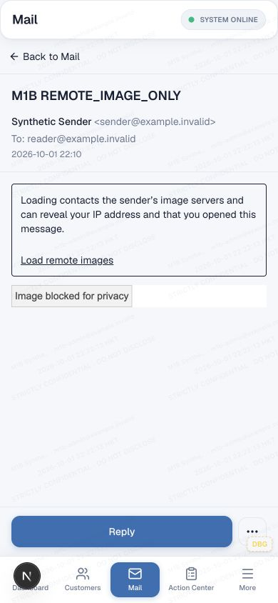
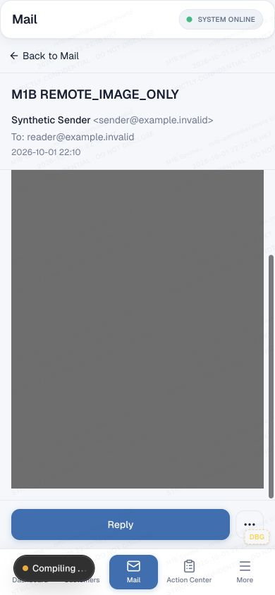
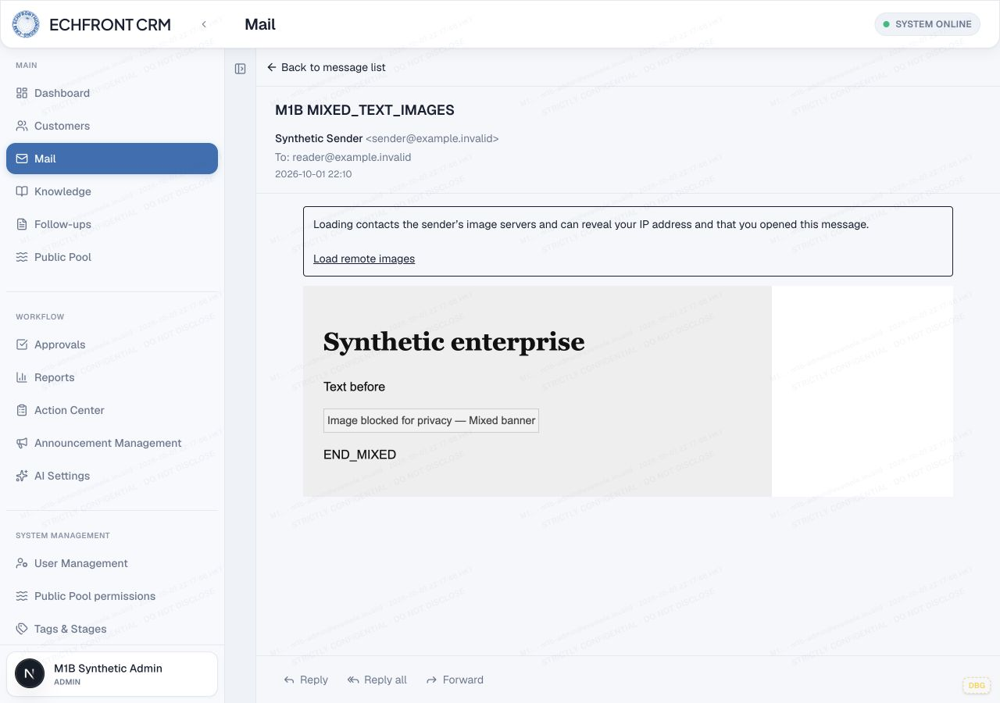

# MAIL M1E — remote-image privacy and CID contract

2026-10-01. Branch `fix/mail-safe-image-policy`, starting exactly at M1D `b5b03448f5e3aecf4e6973b8b998167ada0807bb`. Main remains `f5ca38e06fe898faed71d22f2431ae40f18515dd`.

**M1E REMOTE IMAGE / IMAGE-ONLY LOCALLY VALIDATED**

**CID DURABLE MAPPING REQUIRES SEPARATE SCHEMA REVIEW**

**NOT MERGED TO MAIN — NOT DEPLOYED**

## Verified data contract before editing

| Stage | Remote HTTP(S) image under v3 | CID inline image under v3 |
|---|---|---|
| PostalMime / `inbound-mime-parser.ts` | Original HTML contains src/alt/dimensions in memory | HTML contains cid reference; attachment includes bytes, filename, MIME, sortOrder, disposition and contentId |
| Server sanitizer | Removes img and its src/alt/dimensions | Removes img/cid reference |
| Materializer / canonical body | No image metadata in stored HTML; version recorded in existing body row | Same; no durable HTML-to-file mapping |
| `mail_stored_files` | Ordinary file provenance/location/hash/scan metadata only | No Content-ID/disposition |
| `mail_message_attachments` | Message + storedFileId/hash/filename/MIME/size/sortOrder/delivery metadata | No Content-ID/disposition; ordering is not an identity mapping |
| Reader | No resource fetch possible; image-only empty table fails text-based meaningful predicate | No reconstruction; image-only can remain empty |

`inbound-message-materialization-service.ts` inserts neither parser `contentId` nor `disposition` into either table. Repository schema search finds no alternative durable CID field. Raw MIME can retain original markup only while the existing retention lifecycle keeps it; it is not a dependable reader contract. M1E neither reparses nor rewrites historical messages.

`mail-attachment-download-service.ts` already checks the attachment's message through `assertCanReadMessageForPublicApi`, file ID/hash relationship, size, R2 provider and download eligibility. Authorized bytes are available, but there is no unambiguous CID→attachment identity. Guessing by filename, attachment order or cross-message file lookup would be incorrect.

### Required future CID review, not implemented

Proposed additive shape: nullable normalized Content-ID and MIME disposition on **message attachment**, because these describe the MIME part/message relationship, not globally shared bytes. Preserve the existing attachment→stored-file composite integrity constraint and message FK. Index `(message_id, content_id_normalized)`; do not silently select the first match. A nonunique index preserves duplicate MIME parts; a future resolver must require exactly one match and safely reject ambiguity. If a separate part mapping table is preferred, define its message/attachment FK and identity/duplicate policy before implementation.

Review normalization (angle brackets, case/encoding), bounded metadata, disposition check constraints, allowed raster MIME/byte verification, scan eligibility, message authorization, and ambiguous/missing lookup responses together. An additive migration must leave old rows NULL; no automatic backfill can assume raw MIME exists. No migration0092, historical reprocessing, API contract or permission change was made. CID_SINGLE parser metadata is tested; CID_MULTIPLE/MISSING/DUPLICATE delivery was **not implemented or claimed validated**.

## Versioned no-schema implementation

`inbound-v4` uses the existing canonical HTML and sanitization-version columns. New remote `` becomes an inert span with reserved `data-mail-image-v1` metadata: a percent-encoded JSON tuple `[validatedUrl, alt, width, height]`. The reserved marker is non-fetching; there is no src, srcset, CSS URL or image element in initial canonical HTML.

- Only strictly parsed absolute HTTP(S); rejects controls, backslashes, credentials, non-host characters, relative/protocol-relative and all active/data/CID schemes. URL limit4096 characters.
- Alt limit500 characters, rendered via `textContent`/DOM properties, never HTML interpolation.
- Optional integer width/height1–2000. Dimensions remain metadata until trusted rendering.
- Existing reserved spans revalidate by the same contract, preserving idempotency. Sender styles/events on descriptors cannot override application placeholder presentation.
- Existing safe v3 inline formatting allowlist remains. Images, CSS URLs/imports, srcset, sender scripts/events/forms/embeds/stylesheets remain unavailable to sender markup.
- No new attachment storage contract, dependency or server fetch/proxy path.

The resolver recognizes **valid canonical descriptors**, including no-alt image-only mail, as meaningful HTML. Invalid reserved attributes, comments containing descriptors and arbitrary empty spans do not qualify; existing plain-text fallback remains. Newly sanitized hidden-preheader hiding CSS is removed by the unchanged v3 presentation restrictions, so an image descriptor is visibly represented rather than hidden behind preheader semantics. This predicate is for server-canonical content, not raw HTML.

## Reader privacy and explicit loading

The script-disabled M1D iframe remains `sandbox="allow-same-origin"` only; no script/form/top-navigation/pop-up capability. Initial CSP still includes `img-src 'none'` and deny-by-default other resources. Trusted parent code creates localized placeholders after document load. English, Simplified Chinese and Traditional Chinese use normal source/generated locale catalogs.

Normal placeholders preserve bounded width and alt context. Images with both declared dimensions≤4 receive a compact “Small image blocked” label; they are not silently discarded or inferred malicious. No large fake image-height reservation. A message-level explanation and **Load remote images** button remain outside sender content.

Opt-in is for the current message view only. A new script-disabled document instance receives CSP image origins derived solely from that canonical body's validated descriptors; trusted parent code activates only their exact URLs with `img.referrerPolicy="no-referrer"`. All other CSP directives remain denied, and no other resources are discovered or activated. Origin-scoped CSP is defense in depth, not an exact-path fetch allowlist; exact URL selection is enforced by the descriptor/DOM construction. Cross-origin redirect targets outside the represented origins remain subject to CSP/browser policy. Normal direct browser loads may follow allowed redirects and use ordinary browser cookie/mixed-content rules.

Direct loading **reveals IP/network metadata and may trigger open tracking**. No-referrer is not anonymity and does not prevent tracking. There is no proxy, persistent sender trust or server-side fetch. Reload, reopening or switching message resets opt-in; message identity keys prevent consent carrying to another message, including identical bodies. Loaded images use max-width100% and natural proportional height. ResizeObserver/rAF measurement remains parent-owned, bounded, and cleaned up; no sender script/postMessage or polling was added. A fresh iframe key at opt-in avoids mutating a live srcdoc navigation in place.

Security references: [CSP image sources](https://developer.mozilla.org/en-US/docs/Web/HTTP/Reference/Headers/Content-Security-Policy/img-src), [iframe sandbox](https://developer.mozilla.org/en-US/docs/Web/HTML/Reference/Elements/iframe). Mail read/send-as and file delivery permissions are unchanged.

## Synthetic local evidence

Reused M1B disposable runtime `/var/folders/4q/8s0trbh12bs9lmchml8qhkxw0000gn/T/crm-mail-m1b-ZWJBkz`, actual `/mail` at127.0.0.1:3299, normal synthetic Admin authentication, production-read-source implementation against **local** dummy D1 and emulated R2. Exact guard requires dummy database ID ending0001b0, `remote:false`, no service/AI/Email bindings and all mail transports disabled. Existing actors/mailboxes are reused; no sender identity or authorization changes.

New fixtures use real MIME parsing/server sanitization, then the existing test-only local DB insertion pattern. They exercise real body storage, API retrieval and production reading pane, not a standalone renderer. They do not simulate inbound delivery transport or replay the whole ingestion queue. No old fixture was rewritten.

A test-only HTTP canary binds127.0.0.1:3399, serves generated PNG bytes, has no upstream fetch, logs only synthetic path/referrer/time, and returns404 for unknown paths. Fixtures cover banner, no-alt image-only, multiple images,1×1,3×3, mixed table/text, alt text, malicious image URLs/events/srcset, CSS background/import attempts. No third-party tracking endpoint.

| Final browser gate | Result |
|---|---|
| 9 image fixtures ×1280×900 /390×844 | **18 cases;300/300 assertions** |
| Initial image-content requests | **0** |
| Explicit opt-in image requests | **20 expected /20 observed** |
| Unexpected canary paths | **0** |
| Referrer headers | **0** |
| Active sender elements/events | absent |
| Image-only state | visible blocked placeholder, no empty-body message |
| Script-disabled sandbox / no inner vertical range | PASS |
| Final markers/footer actions / no document overflow | PASS |
| M1C/M1D historical fixtures | **12 cases;180/180 assertions** |

Committed evidence extracts retain assertions, primary scroll geometry, marker/attachment/action hit tests and inner document/security state; repetitive ancestor clipping arrays and duplicate intermediate stages remain in the full raw JSON under the disposable runtime (`m1e-verified-images`, `m1e-verified-mobile`, `m1e-fidelity-regression`, `m1e-fidelity-mobile`). No failed assertion was removed from a completed result.

[Summary](m1e-evidence/summary.json), [image geometry/request evidence](m1e-evidence/images.json), [fidelity/scroll evidence](m1e-evidence/fidelity.json), [unchanged persisted bodies](m1e-evidence/persistence.json).

M1C/M1D checks include LONG_HTML (all10003 paragraphs), QUOTED_LONG, ENTERPRISE_TABLE, APPLE_STYLE_NO_IMAGES, historical v2 image-only empty state, and malicious HTML at both widths. All six original v2 SHA-256 body hashes remain unchanged; all nine new v4 bodies exactly match their fixture manifest after viewing. Image activation never changes persisted bodies. CRM typography stays outside the document; sender table padding/hierarchy remains as accepted in M1D. Existing attachments/footer/actions remain reachable.

Mobile no-alt image initially has a compact placeholder. After one explicit load, natural600×900 renders358×537; outer body clientHeight468/scrollHeight627/scrollTop159; image/frame bottom693, scroll bottom709, navigation top778. The end is reachable above chrome. Resizing produced no extra image request. Reload/reopen and switching reset the control and generated no new request until another opt-in.





### Runtime limitations and diagnostic attempts

An early opt-in used live srcdoc replacement and lost the reader selection during inspection; final code uses a fresh keyed iframe document. A marker probe initially omitted div markers (CSS fixture); the probe now includes div without weakening reachability. Breakpoint/reload/list refresh can clear the shell selection, as already documented in M1C; normal reopening is used. Final desktop/mobile cases are retained from completed runs, not relabeled failed checks.

The instrumented tab recorded two `MutationObserver.observe` “parameter1 is not of type Node” errors during stale/removed-element probe failures; it supplied no source stack, so attribution is **unproven**. These were not ResizeObserver/React loops. A fresh normal-interaction tab, without frame geometry probes during transitions, remained warning/error-free through open→opt-in→scroll→switch and subsequent observation. [Diagnostic runtime](m1e-evidence/runtime.json), [clean observation console](m1e-evidence/clean-console.json). No Maximum update depth, ResizeObserver loop, body GET loop or canary storm was observed. Request evidence is browser/resource inventory plus local canary logs, not packet capture.

Browser coverage is the existing Codex in-app browser against Next dev. Physical touch, software keyboard, nonzero physical safe-area inset, other browser engines and authenticated production-build browser serving remain untested. The safe local build passed; no new production-serving bridge was invented.

## Validation commands and results

```sh
# Exact disposable runtime only; seeder refuses unexpected config/existing IDs:
env -i HOME="$HOME" PATH="$PATH" TMPDIR="$TMPDIR" WRANGLER_SEND_METRICS=false node --import tsx scripts/mail-reader-geometry/seed-images.ts --local
env -i HOME="$HOME" PATH="$PATH" TMPDIR="$TMPDIR" NEXT_TELEMETRY_DISABLED=1 WRANGLER_SEND_METRICS=false npm run dev -- --webpack --hostname 127.0.0.1 --port 3299
node scripts/mail-reader-geometry/image-canary.mjs "$M1_RUNTIME/m1e-canary.jsonl"
```

The existing permitted browser adapter runs `runImagePrivacy` from `image-browser.mjs` with the fixture manifest and loopback request log, and `runFidelity` from `fidelity-browser.mjs` with preserved v2/v3 manifests. Optional `sizes` permits separately completed viewport runs after observed shell navigation transitions. No browser package installation.

```sh
npm run generate:locales
node --import tsx --test src/lib/mail/inert-image.test.ts src/lib/mail/inert-image-locales.test.ts src/lib/mail/inbound-body-html-fidelity.test.ts src/lib/mail/inbound-body-html-sanitizer.test.ts src/lib/mail/client/mail-message-body.test.ts src/components/mail/mail-isolated-html-document.test.ts scripts/mail-reader-geometry/fixtures.test.ts src/lib/mail/inbound-mime-parser.test.ts src/lib/mail/outbound-body-html-sanitizer.test.ts src/lib/mail/client/compose-reply-body.test.ts src/lib/mail/client/mail-compose-reply-regression.test.ts src/lib/mail/client/mail-message-detail-loading.test.ts src/lib/mail/client/mail-desktop-ux-regression.test.ts
node node_modules/typescript/bin/tsc --noEmit --incremental false
node node_modules/eslint/bin/eslint.js src/lib/mail/inert-image.ts src/lib/mail/inert-image.test.ts src/lib/mail/inert-image-locales.test.ts src/lib/mail/inbound-body-html-sanitizer.ts src/lib/mail/client/mail-message-body.ts src/lib/mail/client/mail-isolated-document.ts src/components/mail/mail-isolated-html-document.tsx src/components/mail/mail-message-body-renderer.tsx src/components/mail/prototype/mail-production-reading-pane.tsx scripts/mail-reader-geometry/image-canary.mjs scripts/mail-reader-geometry/image-fixtures.ts scripts/mail-reader-geometry/seed-images.ts scripts/mail-reader-geometry/image-browser.mjs scripts/mail-reader-geometry/fidelity-browser.mjs
git diff --check
```

- Focused combined unit set: **105 PASS /1 inherited FAIL (106 total)**. Nineteen new image/locale tests; existing fixture/fidelity assertions updated only for the explicitly versioned v4 contract. Historical persisted evidence preserved.
- Named debt unchanged: `mail-desktop-ux-regression.test.ts`, “moves desktop attachment action to the bottom action bar”; regex still expects literal submitApproval rather than the existing label resolver. No test removed/weakened, compose source unchanged.
- Real translator plus generated-catalog parity covers all five image strings in en/zh-Hans/zh-Hant. Browser evidence is English; no claim of all-locale browser acceptance.
- Main TypeScript and focused ESLint: PASS.
- Canonical `npm run build`: PASS (Next16.2.9). Existing middleware-deprecation warning only. Isolated source copy `/var/folders/4q/8s0trbh12bs9lmchml8qhkxw0000gn/T/crm-mail-m1e-build-qhrwm19f`, same dummy local configuration, copied already-installed dependencies, no installation. `prebuild` generates locales; `build` is `next build`; no postbuild/deploy hook. Command:

```sh
env -i HOME="$HOME" PATH="$PATH" TMPDIR="$TMPDIR" NEXT_TELEMETRY_DISABLED=1 WRANGLER_SEND_METRICS=false npm run build
```

## Unchanged boundaries

Existing inbound-v2/v3 rows remain exactly as stored; already removed remote/CID markup cannot be restored. Historical image-only mail can still be empty. M1E applies to newly materialized v4 mail; no automatic raw-MIME reprocessing/backfill.

Outbound sanitizer strips descriptor attributes and never activates images. Existing reply/forward, attachment, signature, immutable revision/approval and send-as policy tests pass; M1F quote fidelity is separate. No database migration, permissions change, public R2 URL, image proxy, trust store, Mail/AI send, Production query, deploy, Cloudflare/DNS/Email Routing action or main/parent-branch modification.

Independent remote-image/image-only scope is complete locally. CID remains blocked pending explicit schema/storage/authorization design review. M1F/M2 and deployment require separate authorization.
